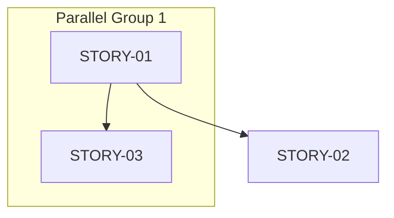

# Breakdown Stage: Decompose

TDD → Jira stories + epic. Steps 1-8.

---

## Step 1: Read Inputs (single pass)

1. TDD — single: `docs/features/{slug}/design/TDD.md` | multi: `TDD_MASTER.md` + all `TDD_{REPO}.md`  
   OR lite tier: `docs/features/{slug}/design/IMPLEMENTATION_BRIEF.md`  
   Focus: slices/delivery slice, components, data models
2. `docs/features/{slug}/planning/PRD.md` — S6 (stories), ACs, scope, repos
3. `docs/features/{slug}/design/SYSTEM_DESIGN_NOTES.md` — context, flow, ADRs (skip if lite tier — not produced)
4. `docs/features/{slug}/input/jira/` — prefer `*.md` extracted files. Fall back to `*.json` if `.md` absent. Skip if folder absent.

---

## Step 2: Intelligence Pass

**Most critical step. Do not skip.**

Classify every TDD slice:

```
STORY  — observable behavior. Human verifies done without reading code.
MERGE  — structural / config-only / DI wiring / test-only / <30 min → absorb into adjacent
SPLIT  — >5 SP → divide at behavior boundary (never layer boundary)
```

**Merge:** absorbing story owns all work. Note in Dev Notes only.

**Split:**
- ❌ layer boundary: "service layer + API layer"
- ✅ behavior boundary: "create-flow + update-flow"

**Single-repo rule:** one story = one repo. Slice touches two repos → split:

```
STORY-XX: {behavior} in {repo-A}  ← implement first
STORY-XY: {behavior} in {repo-B}  ← Blocked By: STORY-XX
```

Flag cross-repo splits for human review.

**SP = human course-correction risk:**

| SP | Risk      | When                            |
|----|-----------|---------------------------------|
| 1  | Minimal   | Single behavior, trivial verify |
| 2  | Low       | Clear scope, easy verify        |
| 3  | Medium    | Standard, some integration      |
| 5  | High      | Complex, multi-integration      |
| >5 | Too risky | Split at behavior boundary      |

Max 5 SP. No exceptions. Genuinely unsplittable at 5 SP → flag `⚠️ Complex`.

**Parallel group detection:** after classifying, find stories with no shared deps + different repos → mark `PARALLEL_GROUP_{N}`. Note: execute runs sequentially — parallel groups are informational for human planning only.

**Relationship detection:** as you classify, track:
- `Blocks` / `Blocked By` — sequential dependency
- `Related` — different behavior, shared context
- `Duplicate` — same behavior reported twice → merge

---

## Step 3: Epic Decision

```
< 3 stories  → no epic
>= 3 stories → epic needed
```

Epic needed → check `FEATURE_INPUT.md` and fetched Jira data for an existing epic key first.  
If found in input → use it, confirm with user.  
If not found → ask:

```
AskUserQuestion({
  "questions": [{
    "header": "Epic needed",
    "question": "Found {N} stories ({N} SP). Link to existing epic or create new?",
    "multiSelect": false,
    "options": [
      {"label": "Use existing epic", "description": "Provide epic key — link all stories under it"},
      {"label": "Create new epic",   "description": "Add EPIC-NEW as first item in breakdown"},
      {"label": "No epic",           "description": "Stories standalone"}
    ]
  }]
})
```

Store resolved epic key in `JIRA_BREAKDOWN.md` header only — not in `config.yml`.

Multi-area: ≥2 independent subsystems each with ≥3 stories → propose child epics. Ask user to confirm.

---

## Step 4: Existing Ticket Reconciliation

Keyword-match candidates against fetched Jira tickets:

```
Match + Done/Closed/Resolved → ✅ COMPLETE — skip
Match + open                 → ⬆️ EXISTING — diff title/desc/ACs, surface for human review. Do NOT auto-update.
No match                     → ⏳ NEW
```

---

## Step 5: Write JIRA_BREAKDOWN.md

**Path:** `docs/features/{slug}/breakdown/JIRA_BREAKDOWN.md`

```markdown
# Jira Breakdown: {Feature Name}
**Date:** {ISO-date} | **Agent:** release-agent (AI-Generated)
**Epic:** {EPIC_KEY | "EPIC-NEW (pending)" | "None"}
**Project:** {project_key}
**Stories:** {N} | **Points:** {N} SP | **Critical Path:** {N} SP
**Push Status:** LOCAL ONLY

> LOCAL IDs only. After Jira push: update JIRA ID column with real keys.
> Status maintained by /execution as stories progress.

---

## Story Overview

| LOCAL ID | JIRA ID | Epic | Repo | Title | SP | Priority | Status | Parallel Group | Blocked By |
|----------|---------|------|------|-------|----|----------|--------|----------------|------------|
| STORY-01 | —       | EPIC-KEY | repo-a | ... | 3 | P1 | ⏳ NEW    | GROUP-1 | —        |
| STORY-02 | PROJ-XX | EPIC-KEY | repo-b | ... | 5 | P0 | ⬆️ EXISTING | —    | STORY-01 |
| STORY-03 | —       | None     | repo-a | ... | 2 | P2 | ✅ COMPLETE | GROUP-1 | —     |

**Status:** ⏳ NEW | ⬆️ EXISTING | ✅ COMPLETE | 🔄 IN PROGRESS | ⚪ DEFERRED

---

## Dependency Graph



**Critical Path:** STORY-01 → STORY-02 ({N} SP)
**Parallel Opportunities:** {e.g. "STORY-01 + STORY-03 can run simultaneously"}

---

## Stories

### STORY-01: {Behavior-focused title}

**SP:** {1-5} | **Priority:** P0/P1/P2 | **Status:** ⏳ NEW
**Epic:** {EPIC_KEY | EPIC-NEW | None}
**Repo:** {single repo name}
**Labels:** `area/{repo}` `priority/p{n}` `effort/{sp}sp`
**PRD:** S{N}, US-{N} | **TDD:** S8 Slice {N}
**Parallel Group:** {GROUP-N | None}

**What:** {one sentence — behavior delivered}
**Why:** {one sentence — why it matters}

**Acceptance Criteria:**

1. GIVEN {observable context} WHEN {action} THEN {observable outcome}
2. GIVEN {observable context} WHEN {action} THEN {observable outcome}
3. GIVEN {observable context} WHEN {action} THEN {observable outcome}

**Dev Notes:**

- Files: {specific paths from design artifact (SYSTEM_DESIGN_NOTES S1 / TDD / IMPLEMENTATION_BRIEF S3)}
- Key implementation: {from TDD — what matters, not how}
- Merged from: {absorbed slices | None}
- ⚠️ Complex: {human checkpoint recommended if 5 SP}

**Blocked By:** {STORY-XX | None}
**Blocks:** {STORY-XX | None}
**Related:** {STORY-XX | None}

---

{repeat per story}

---

## Existing Tickets — Review Required

{Only if EXISTING tickets found}

| LOCAL ID | JIRA ID | Current Title | Proposed Changes     |
|----------|---------|---------------|----------------------|
| STORY-02 | PROJ-XX | Old title     | Update desc, add ACs |

---

## Execution Log

> Append-only. Updated by /execution as stories progress.

```
[{ISO-datetime}] {STORY-ID} → {phase} {event}
```

| Metric            | Value                                          |
|-------------------|------------------------------------------------|
| Total stories     | {N}                                            |
| Total SP          | {N}                                            |
| Critical path     | {N} SP                                         |
| ⏳ NEW             | {N}                                            |
| ⬆️ EXISTING       | {N}                                            |
| ✅ COMPLETE (skip) | {N}                                            |
| Parallel groups   | {N} groups, {N} stories can run simultaneously |

```

---

## Step 6: Session Resilience — Register Tasks

After writing JIRA_BREAKDOWN.md, register each ⏳ NEW and ⬆️ EXISTING story as a task:

```
For each story (status != COMPLETE):
TaskCreate({
  title: "[EXEC] {LOCAL-ID}: {story title}",
  status: "pending",
  details: "Repo: {repo} | SP: {N} | Priority: {P} | Blocked By: {deps} | Parallel: {group}"
})
```

`/execute` resumes from `TaskList` if session dies. Tasks = execution tracker. JIRA_BREAKDOWN.md = human artifact.

---

## Step 7: Human Gate (Unconditional)

**Cannot bypass via any config or mode.**

```
AskUserQuestion({
  "questions": [{
    "header": "Breakdown OK?",
    "question": "JIRA_BREAKDOWN.md ready.\n{N} stories | {N} SP | Critical path: {N} SP | {N} parallel groups\n\nReview file — merge/split/defer stories before approving.",
    "multiSelect": false,
    "options": [
      {"label": "✅ Approve — push to Jira",  "description": "Creates NEW stories/epic. Flags EXISTING for update."},
      {"label": "✅ Approve — local only",     "description": "Keep LOCAL IDs. Execute from JIRA_BREAKDOWN.md as-is."},
      {"label": "✏️ Revise first",             "description": "Stop. Edit JIRA_BREAKDOWN.md manually, re-run /breakdown {slug}."},
      {"label": "⏭️ Skip to execution",        "description": "Go straight to /execution using TDD slices directly."}
    ]
  }]
})
```

---

## Step 8: Jira Push (Conditional)

Only if human selects "push to Jira" AND `jira_push: true` in `config.yml`.

Via `/jira-ops` (MCP → Python → Manual fallback):

1. Create epic first (if EPIC-NEW) → store real key as `EPIC_KEY`
2. Per ⏳ NEW → `/jira create` with `parent: EPIC_KEY`, labels, SP
3. Per ⬆️ EXISTING → `/jira update` title + desc + ACs only. Never touch status/assignee/sprint.
4. Create `Blocks`/`Blocked By`/`Related` links
5. Post epic comment:
   ```
   Breakdown: {N} stories, {N} SP, critical path {N} SP, {N} parallel groups.
   ```
6. Update JIRA_BREAKDOWN.md: replace LOCAL IDs with real keys. Push Status → `PUSHED TO JIRA`.
7. Update TaskCreate details with real Jira keys.

**If Jira unavailable at any tier** → write `JIRA_MANUAL_LOG.md`:

```markdown
# Jira Manual Log: {Feature Name}
**Date:** {ISO-date} | **Reason:** {error}

## Stories to Create Manually

### {LOCAL-ID}: {title}
**Type:** Story | **Epic:** {EPIC_KEY | None} | **SP:** {N} | **Priority:** {P}
**Labels:** {labels}
**Description:** {What + Why}
**ACs:** {list}
**Blocked By:** {JIRA key or None}
```

Push Status → `PUSH FAILED — see JIRA_MANUAL_LOG.md`.

---

## Completion

```bash
python3 scripts/gate_transition.py {slug} breakdown approved --artifact docs/features/{slug}/breakdown/JIRA_BREAKDOWN.md
```

```
Breakdown complete: {slug}

Stories: {N} | Points: {N} SP | Critical path: {N} SP
Parallel groups: {N}
Epic: {EPIC_KEY | None}
Push: {LOCAL ONLY | PUSHED TO JIRA | PUSH FAILED}

Tasks registered. Awaiting human approval.
Next: /execute {slug}
```
