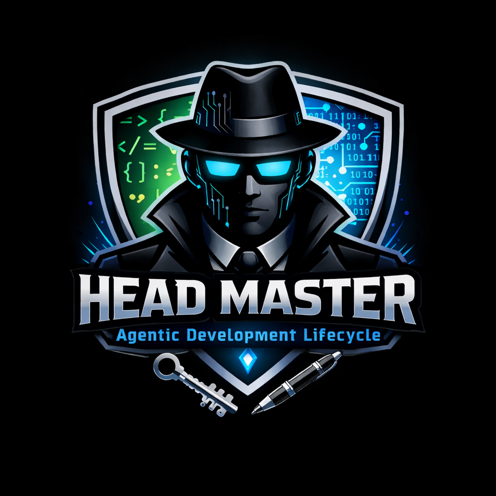
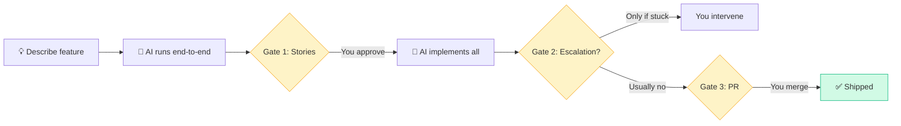
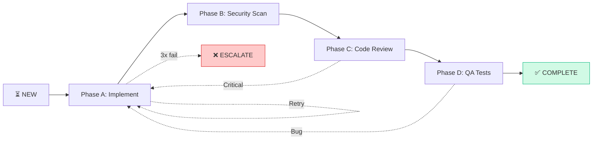

<div align="center">



### 🎯 **ADLC — Agentic Development Lifecycle**

*You describe a feature. AI writes the PRD, designs the system, implements the code, runs security scans, reviews it, and opens the PR. You approve the decisions and merge.*

[](https://python.org)
[](https://docs.anthropic.com/en/docs/claude-code)
[](LICENSE)

</div>

---

## 🚀 3-Gate Autonomous Workflow

**Your involvement:** 10-20 minutes across 1-2 hours of end-to-end delivery



**What you do:**
1. **Gate 1** (2 min): Review story list → approve/revise
2. **Gate 2** (5 min): Fix story if it fails 3x *(rare)*
3. **Gate 3** (5 min): Merge PR

**What AI does autonomously:**
- ✅ Requirements Q&A from code/docs
- ✅ PRD (6/10/14 sections based on complexity)
- ✅ System design + ADRs
- ✅ TDD blueprint
- ✅ Jira stories + epic creation
- ✅ Code + tests (per story)
- ✅ Security scan + code review
- ✅ QA integration tests
- ✅ System audit + PR creation

---

## Why HeadMaster?

Traditional SDLC is **human-driven with AI assistance**. ADLC flips that — **AI drives the full development lifecycle** while humans own the key decisions.

```
Traditional AI Copilot:              HeadMaster (ADLC):
━━━━━━━━━━━━━━━━━━━━               ━━━━━━━━━━━━━━━━━━━━
You write PRD         →             AI writes PRD (you approve)
You design system     →             AI designs system (you approve)
You write code        →             AI writes code (autonomous)
Copilot suggests      →             AI reviews own code
You review            →             AI runs QA tests
You write tests       →             AI creates PR (you merge)
You create PR         →
```

**Nothing ships without your approval. Every gate is explicit. The AI drives — you own the decisions.**

---

## ⚡ Quick Start

### 1. Install (2 minutes)

```bash
git clone <repository>
cd HeadMaster
pip install -r requirements.txt
mkdir -p memory/features

# Configure Claude Code
cp .claude/settings.local.json.example .claude/settings.local.json
```

### 2. Set Autonomous Mode (30 seconds)

Edit `config.yml`:

```yaml
interactive: false   # Auto-decide, only ask when ambiguous
jira_push: true      # Auto-push stories after Gate 1 approval
```

Set Jira credentials (one-time):

```powershell
[System.Environment]::SetEnvironmentVariable("ATLASSIAN_DOMAIN", "company.atlassian.net", "User")
[System.Environment]::SetEnvironmentVariable("JIRA_USER_EMAIL", "you@company.com", "User")
[System.Environment]::SetEnvironmentVariable("JIRA_API_TOKEN", "your-token", "User")
```

### 3. Start Your First Feature (1 command)

```bash
claude --name "my-feature"
/navigate "Add rate limiting to the public API"
```

**That's it.** HeadMaster classifies complexity, generates PRD, designs system, breaks down stories, waits for your Gate 1 approval, then implements everything.

**Typical timeline:** Coffee break to lunch (depending on feature size).

---

## 📊 Complexity Tiers (Auto-Detected)

Not every feature needs a 14-section PRD. HeadMaster auto-classifies at `/navigate`:

| Tier | When | PRD | Design | Stories | Example |
|------|------|-----|--------|---------|---------|
| **🟢 Lite** | 1-2 stories, single repo, known approach | 6 sections | IMPLEMENTATION_BRIEF (5 sections) | 1-2, no dependencies | "Add validation to form field" |
| **🟡 Standard** | 3-5 stories, 1-2 repos, some integration | 10 sections | TDD.md (8 sections) | 3-5, serial dependencies | "Add export feature with 3 formats" |
| **🔴 Full** | 6+ stories, multi-repo, complex integration | 14 sections | TDD.md (11 sections) or TDD_MASTER + per-repo | 6+, parallel groups | "Migrate Elasticsearch 5→9 across 5 repos" |

**Override:** `/navigate my-feature --tier lite` (if AI gets it wrong)

---

## 🎯 Pipeline Stages

Each stage has a hard gate — no skipping, no shortcuts:


| Stage | Input | Output | Auto-Decides | You Decide |
|-------|-------|--------|--------------|------------|
| **Plan** | Feature description, Jira/Confluence | PRD (6/10/14 sections) | Requirements Q&A, discovery gaps | *(autonomous)* |
| **Design** | PRD | SYSTEM_DESIGN_NOTES + TDD | Architecture patterns, tech stack | *(autonomous)* |
| **Breakdown** | TDD | JIRA_BREAKDOWN.md | Story splitting (1-5 SP), epic creation | **✅ Gate 1: Approve stories** |
| **Execute** | Stories | Code + tests + reviews | Implementation, retries (up to 3x) | **✅ Gate 2: Fix if 3x fails** |
| **Merge Gate** | All stories done | PR | System audit, rollback plan | **✅ Gate 3: Merge PR** |

---

## 🔥 What Makes It Different

### 1. **Autonomous by Default**
- No back-and-forth Q&A during planning (discovers from code/docs)
- No "approve each commit" — batches per story
- Only stops at 3 gates (stories, escalations, merge)

### 2. **Isolated Agent Reviews**
- Code reviewer agent has **zero implementation context** (reads git diff cold)
- QA agent has **zero dev/review context** (writes tests from ACs only)
- System review agent has **zero per-story context** (audits TDD vs actual)
- **Why:** Catches issues the implementer missed due to context blindness

### 3. **Failure Learning**
- Each retry recorded in append-only ledger
- Next attempt must be **structurally different** (70%+ word overlap blocked)
- **No infinite loops:** 3 attempts → human escalation

### 4. **Convergence Detection**
- Review loops track if same blocker reappears after being "fixed"
- Uses word-overlap normalization (same issue, different wording)
- **Auto-escalates** instead of looping forever

### 5. **Cost Discipline**
```
Model per Task:
━━━━━━━━━━━━━━━━━━━━━━━━━━━━━━━━━━━━━━━━━━━
🟣 Opus    → Architecture design ONLY
🔵 Sonnet  → Code, PRD, reviews, QA
🟢 Haiku   → Checklists, search, scan

Result: 60-80% cost savings vs "Opus everywhere"
```

### 6. **Session Age Management**
```
Turn-based thresholds (configurable):
━━━━━━━━━━━━━━━━━━━━━━━━━━━━━━━━━━━━━━━━━━━
🟡 15 turns  → Notice (session getting long)
🟠 25 turns  → Auto-checkpoint saved to memory/
⛔ 35 turns  → Auto-handoff + clear context
```

Heavy file reads (>500KB) trigger earlier thresholds. Auto-braindump at 🟠 provides recovery point without terminating execution.

---

## 🧠 Memory Architecture

Two separate systems (no confusion):

### 1. **Feature Memory** (HeadMaster-managed)
```
memory/features/{slug}/
├── loop_state.json              # Pipeline phase, iteration, tier
├── session-{timestamp}.md       # Manual handoffs (/handoff command)
├── session-{timestamp}-auto.md  # Auto-checkpoints at 🟠 threshold
└── agents/
    ├── developer.md             # Retry history, files touched (per-story)
    ├── qa-engineer.md           # Test failures, edge cases
    └── review-agent.md          # Review patterns, false positives
```
**Lifecycle:** Created during feature work, **discarded after ship**

### 2. **Agent Memory** (Claude Code-managed)
```
.claude/agent-memory/
├── developer/                   # Codebase conventions, build quirks
├── web-researcher/              # API research patterns
└── codebase-analyst/            # Module boundaries, naming patterns
```
**Lifecycle:** Automatic, **persists across all features**

**Key distinction:** Feature memory is ephemeral (per-feature), agent memory is permanent (per-project).

---

## 🛠️ Execution Phases (Per Story)



| Phase | Tool | Gate | Retry Trigger |
|-------|------|------|---------------|
| **A — Implement** | `/implement` | Build green, all tests pass | *(automatic, max 3x)* |
| **B — Security** | `/security-scan` | 0 secrets, 0 critical CVEs | Secrets found → fix → retry |
| **C — Review** | `/review-code` (isolated agent) | 0 critical/high findings | Critical logic bug → fix → retry |
| **D — QA** | `/qa-integration` (isolated agent) | All ACs pass | Regression → fix → retry |
| **E — System Audit** | `/review-system` (isolated agent) | 0 actionable findings | *(final audit, no retry)* |

**Escalation:** If any phase fails 3x, Gate 2 triggers → you investigate, fix manually, `/execute {slug}` resumes.

---

## 📦 Reliability Features

### 🔒 Git Guard
```python
# Blocks destructive operations (PreToolUse hook)
❌ git push --force
❌ git reset --hard
❌ git clean -fd
❌ git rebase -i
❌ git filter-branch

✅ git push origin story/PROJ-123  # Safe operations allowed
```

### 🔄 Crash Recovery
If session dies mid-execution:
```bash
/execute my-feature  # Resume command

# Pre-flight checks each IN PROGRESS branch:
- Dirty working tree? → Stash or reset (you choose)
- Broken build? → Soft reset HEAD~1 (you choose)
- Clean? → Continue normally
```

### 🎯 Convergence Detection
```
Iteration 1: Blocker A fixed
Iteration 2: Blocker B fixed
Iteration 3: Blocker A reappears (same issue, different wording)
━━━━━━━━━━━━━━━━━━━━━━━━━━━━━━━━━━━━━━━━━━━━━━━━━━━━━━
Result: ⛔ Auto-escalate (oscillation detected)
```

### 📝 Failure Ledger
```json
{
  "STORY-123": {
    "attempts": [
      {
        "approach": "Used raw SQL concatenation",
        "error": "SQL injection detected by security scan",
        "hypothesis": "Should use PreparedStatement"
      },
      {
        "approach": "Used PreparedStatement",  // ✅ Structurally different
        "error": "...",
        "hypothesis": "..."
      }
    ],
    "excluded_approaches": ["raw SQL concat", "string interpolation"]
  }
}
```

Next retry checks word overlap — 70%+ similar to prior failure → ⛔ blocked.

---

## 💰 Token Optimization

Layered reduction (compounds):

| Layer | Technique | Saving |
|-------|-----------|--------|
| **Model routing** | Opus only for architecture, Haiku for checklists | 60-80% vs Opus everywhere |
| **Complexity tiers** | Lite = 6-section PRD, not 14 | 40-60% fewer artifacts |
| **Lazy loading** | Skills split into stage files — load active stage only | 250-350 lines/skill saved |
| **Read compression** | Hook compresses memory/*.md before Claude sees it | 30-60% per read |
| **Input extraction** | Strips Jira/Confluence API noise → lean .md | 70-85% per input |
| **Context discipline** | Each phase loads only required artifacts | Prevents 2-3x bloat |
| **Stop hooks** | Python scripts replace Haiku agents for gate checks | ~10 Haiku calls saved |

**Result:** Full pipeline (planning → design → 5 stories → merge) typically uses **100K-150K tokens** (vs 500K+ naive approach).

---

## 📁 Project Structure

```
HeadMaster/
├── .claude/
│   ├── skills/                   # 13 skills (lazy-loaded stages)
│   │   ├── plan/stages/          # init → discover → draft → review
│   │   ├── design/stages/        # architect → engineer → review
│   │   ├── execute/stages/       # setup → story-loop → finalize
│   │   └── ...
│   ├── agents/                   # 12 specialists (behavior constraints)
│   ├── commands/                 # 5 atomic ops (commit, handoff, create-pr)
│   ├── hooks/                    # 8 lifecycle hooks
│   │   ├── stop_checks/          # 4 gate validators (Python, not Haiku)
│   │   ├── read_compressor.py    # Compress memory reads
│   │   ├── post_tool.py          # Track tool calls + compress writes
│   │   ├── token_budget.py       # Session age tracking
│   │   ├── auto_braindump.py     # Progressive checkpoints
│   │   └── ...
│   └── CLAUDE.md                 # System prompt (compact)
│
├── scripts/                      # 10 Python utilities
│   ├── gate_transition.py        # Atomic pipeline state management
│   ├── convergence_check.py      # Review loop oscillation detection
│   ├── failure_ledger.py         # Retry history per story
│   ├── diff_scanner.py           # Security: secrets + SAST + CVEs
│   ├── jira_ops.py               # Jira API: create, update, link
│   ├── compress.py               # Shared compression engine
│   └── ...
│
├── docs/features/{slug}/         # Generated per feature
│   ├── planning/PRD.md           # ← Source of truth post-approval
│   ├── design/TDD*.md            # ← Implementation blueprint
│   ├── breakdown/JIRA_BREAKDOWN.md  # ← Story list + execution tracker
│   ├── execution/reviews/        # Per-story: security, code, qa, escalation
│   └── retrospective/system-review.md  # Design vs actual audit
│
├── memory/
│   ├── session-budget.json       # Live: turn count, bytes read, tool calls
│   ├── features/{slug}/          # Per-feature state (ephemeral)
│   │   ├── loop_state.json       # Pipeline phase, iteration, tier
│   │   ├── session-*.md          # Handoffs + auto-checkpoints
│   │   └── agents/*.md           # Per-story retry history
│   └── .claude/agent-memory/     # Cross-feature learnings (permanent)
│
├── config.yml                    # Project config
└── requirements.txt              # Python deps
```

---

## 🎓 Example Walkthrough

### Input (30 seconds)
```bash
claude --name "api-rate-limit"
/navigate "Add rate limiting to public API - 100 req/min per client"
```

### AI Execution (45 minutes, autonomous)

**Stage 1: Plan** *(5 min)*
```
✅ Classified as Standard tier (3-5 stories, 1 repo)
✅ PRD generated (10 sections)
✅ Discovered: Redis already used for caching → reuse for rate limit store
✅ PRD approved (0 blockers in review)
```

**Stage 2: Design** *(10 min)*
```
✅ Architecture: Token bucket algorithm
✅ ADR-1: Redis over in-memory (multi-instance requirement)
✅ TDD: 8 sections, 3 vertical slices
✅ TDD approved (0 blockers in review)
```

**Stage 3: Breakdown** *(2 min)*
```
✅ 3 stories identified:
   PROJ-101: Rate limit middleware (3 SP)
   PROJ-102: Redis token bucket impl (2 SP)
   PROJ-103: API response headers (1 SP)
✅ Epic created: PROJ-100
━━━━━━━━━━━━━━━━━━━━━━━━━━━━━━━━━━━━━━━━━━━━━━
🟡 GATE 1: Approve story list? (you: 2 min)
```

**You:** ✅ Approve

**Stage 4: Execute** *(25 min)*
```
PROJ-101: Middleware
  Phase A: Implement → ✅ (3 commits)
  Phase B: Security → ✅ (0 secrets, 0 CVEs)
  Phase C: Review → ✅ (0 findings)
  Phase D: QA → ✅ (3/3 ACs pass)
  
PROJ-102: Token bucket
  Phase A: Implement → ✅ (2 commits)
  Phase B: Security → ✅
  Phase C: Review → ✅
  Phase D: QA → ✅ (2/2 ACs pass)
  
PROJ-103: Headers
  Phase A: Implement → ✅ (1 commit)
  Phase B: Security → ✅
  Phase C: Review → ✅
  Phase D: QA → ✅ (1/1 ACs pass)

Phase E: System Review → ✅ (0 actionable findings)
━━━━━━━━━━━━━━━━━━━━━━━━━━━━━━━━━━━━━━━━━━━━━
✅ PR created: feature/api-rate-limit → main
```

**Stage 5: Merge Gate** *(3 min)*
```
🟡 GATE 3: Review PR and merge (you: 3 min)
```

**Total:** Your time: 5 min | AI time: 45 min | End-to-end: 50 min

---

## ⚙️ Configuration

### Autonomous Mode (Recommended)

Edit `config.yml`:

```yaml
interactive: false   # Auto-decide, log rationale, only ask when ambiguous
jira_push: true      # Auto-push to Jira after Gate 1 approval
max_loops: 3         # Max review iterations before escalation
parallel: false      # true = run independent stories simultaneously (advanced)
default_tier: "full" # Fallback if /navigate can't determine
```

### Session Thresholds (Optional)

```yaml
session_budget:
  turn_warn_yellow: 15   # First warning
  turn_warn_orange: 25   # Auto-checkpoint (non-blocking)
  turn_warn_red: 35      # Auto-handoff (terminates session)
```

Adjust based on your workflow. Heavy research features may need higher limits.

### Jira Credentials (One-time)

```powershell
# Windows (permanent)
[System.Environment]::SetEnvironmentVariable("ATLASSIAN_DOMAIN", "company.atlassian.net", "User")
[System.Environment]::SetEnvironmentVariable("JIRA_USER_EMAIL", "you@company.com", "User")
[System.Environment]::SetEnvironmentVariable("JIRA_API_TOKEN", "your-api-token", "User")

# Restart terminal for env vars to take effect
```

Get token: https://id.atlassian.com/manage-profile/security/api-tokens

---

## 🤖 Autonomous Mode

### What Runs Automatically (`interactive: false`)

| Stage | Auto-Decides |
|-------|-------------|
| **/plan** | Discovery Q&A from codebase/docs, ambiguity resolution, PRD drafting, review loops (max 3) |
| **/design** | Architecture patterns, tech stack (follows PRD Repos), TDD generation, review loops |
| **/breakdown** | Story classification (STORY/MERGE/SPLIT), SP estimation, epic creation, Jira push |
| **/execute** | Implementation, security scan, code review, QA tests, system review, PR creation |

### When HeadMaster Stops to Ask (Confusion Clause)

Even with `interactive: false`, HeadMaster stops if:
- **Ambiguity** — two valid interpretations, wrong choice derails downstream work
- **Contradiction** — code vs docs vs Jira disagree on a fact
- **Missing input** — required info absent, can't infer from context
- **Destructive action** — about to delete/overwrite something irreversible

These questions are tagged `[CLARIFICATION]` — autonomous mode resumes after your answer.

### Unconditional Human Gates (never skipped)

1. **/breakdown Step 7** — review story list before execution starts
2. **/execute escalation** — story failed 3x, needs human intervention
3. **PR merge** — final approval before merging to main

### Override Any Decision

At any gate you can edit the artifact directly and re-run the skill:

```bash
# Edit PRD, then re-run planning
/plan {slug}

# Edit TDD, then re-run design
/design {slug}

# Edit JIRA_BREAKDOWN.md, then re-run execution
/execute {slug}
```

HeadMaster detects the change and adapts downstream work.

### Where to Find AI's Reasoning

| Decision type | Location |
|--------------|----------|
| Discovery resolutions | `docs/features/{slug}/planning/DISCOVERY_NOTES.md` |
| Architecture decisions (ADRs) | `docs/features/{slug}/design/SYSTEM_DESIGN_NOTES.md` |
| Story classification rationale | `docs/features/{slug}/breakdown/JIRA_BREAKDOWN.md` |

### Rollback a Gate

If HeadMaster approved a gate prematurely:

```bash
python scripts/gate_transition.py {slug} rollback  # restores previous loop_state.json
```

Then re-run the skill to fix the issue.

---

## 🐛 Troubleshooting

| Problem | Solution |
|---------|----------|
| **Feature not resuming** | `/navigate {slug}` — detects phase from artifacts + loop state |
| **Undo Claude changes** | `Esc + Esc` → checkpoint picker (Claude Code built-in) |
| **Review loop stuck** | Check `memory/features/{slug}/loop_state.json` → `last_blocker_type` |
| **Jira push failing** | Verify env vars: `echo $env:JIRA_USER_EMAIL`, check `jira_push: true` in config |
| **Story failed 3x** | Check `execution/reviews/escalation-{STORY-KEY}.md` for full failure ledger |
| **Session age ⛔** | Run `/handoff` manually at 🟠, or increase `turn_warn_red` in config |
| **Hook errors** | Status bar shows ⚠️, check `~/memory/hook-errors.log` for details |
| **Crash mid-execute** | `/execute {slug}` — pre-flight checks branch integrity before resuming |

---

## 📚 Documentation

- **`.claude/CLAUDE.md`** — System prompt + project instructions (what AI reads)
- **`.claude/ARCHITECTURE.md`** — Model routing, memory systems, hook lifecycle (AI reference)
- **`docs/examples/`** — Sample artifacts (PRD, reviews, reports)

---

## 🏗️ Architecture Principles

### 1. **Single Source of Truth**
```
After approval:
- PRD.md         = requirements truth (never read FEATURE_DRAFT again)
- SYSTEM_DESIGN  = architecture truth (never read PRD during execute)
- TDD            = implementation truth (never read SYSTEM_DESIGN during execute)
- JIRA_BREAKDOWN = execution truth (never read TDD during execute)
```

Each phase distills upstream work → downstream reads only the distilled artifact.

### 2. **Isolation by Design**
```
Developer agent    → Knows TDD, not PRD
Code reviewer      → Knows git diff, not TDD
QA agent          → Knows ACs, not implementation
System reviewer   → Knows TDD + git log, finds divergences
```

Isolation prevents "I know what I meant" bias.

### 3. **Deterministic Gates**
```
Python scripts > Haiku agents for gate checks

Why? Cost + reliability:
- Python: 0 tokens, 100% consistent, <50ms
- Haiku:  ~500 tokens, 95% consistent, ~2s
```

Stop hooks use Python. Only spawn agents when judgment required.

### 4. **Progressive Checkpointing**
```
🟡 15 turns → Notice (keep working)
🟠 25 turns → Auto-checkpoint written (keep working)
⛔ 35 turns → Auto-handoff + terminate
```

Long-running `/execute` can complete even if session age exceeds normal threshold.

---

<div align="center">

## 🚀 Get Started

```bash
git clone <repository>
cd HeadMaster
pip install -r requirements.txt
cp .claude/settings.local.json.example .claude/settings.local.json

# Edit config.yml → set interactive: false, jira_push: true
# Set Jira env vars (one-time)

claude --name "my-feature"
/navigate "describe your feature"
```

**HeadMaster takes it from there.**

---

**Questions?** Check `.claude/ARCHITECTURE.md` for deep dive  
**Issues?** [Open an issue](https://github.com/anthropics/claude-code/issues)

</div>
