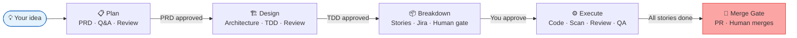
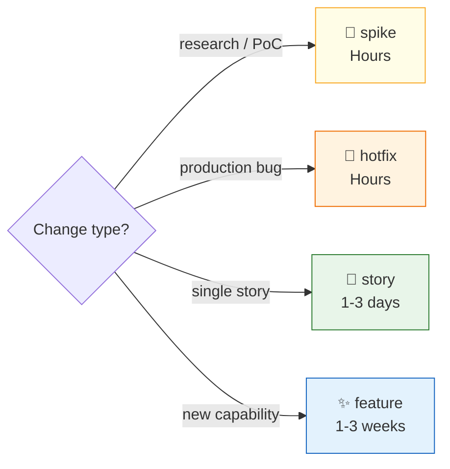

<div align="center">


### 🎯 **ADLC — Agentic Development Lifecycle**

*You describe a feature. AI writes the PRD, designs the system, implements the code, runs security scans, reviews it,
and opens the PR. You approve the decisions and merge.*

[](https://python.org)
[](https://docs.anthropic.com/en/docs/claude-code)
[](LICENSE)

</div>

---

## Why HeadMaster?

Traditional SDLC is **human-driven with AI assistance**.
ADLC flips that — **AI drives the full development lifecycle** while humans own the key decisions.

HeadMaster automates the entire lifecycle — not just code generation, but the full SDLC from idea to production PR —
using a structured pipeline of specialized AI agents, each with a single job and a non-negotiable quality gate.

```
You type:   /navigate "Add rate limiting to the public API"

AI does:    Requirements Q&A → 14-section PRD → System design + ADRs
            → TDD blueprint → Jira stories → Code + tests → Security scan
            → Code review → QA integration tests → System audit → PR

You do:     Approve requirements · Sign off architecture · Merge the PR
```

**Nothing ships without your approval. Every gate is explicit. The AI drives — you own the decisions.**

---

## How It Works



Each arrow is a hard gate — the pipeline cannot advance until the gate condition is met. No skipping, no shortcuts.

| You provide                   | AI handles                       | You decide              |
|-------------------------------|----------------------------------|-------------------------|
| Feature description           | 14-section PRD                   | ✅ Requirements approval |
| Jira ticket / Confluence page | System design + ADRs             | ✅ Architecture sign-off |
| Bug description               | Code + unit tests                | ✅ Story prioritization  |
|                               | Security scan + code review      | ✅ Final PR merge        |
|                               | Integration tests + system audit |                         |

---

## Delivery Routes

Not every change needs the full pipeline. HeadMaster picks the right process:



| Route         | When to use                   | Phases                       |
|---------------|-------------------------------|------------------------------|
| 🔬 **spike**  | Research, PoC, feasibility    | Prototype → Decision         |
| 🔧 **hotfix** | Production bug, config fix    | Implement → Review → PR      |
| 📖 **story**  | Single story, known approach  | Implement → Review → QA → PR |
| ✨ **feature** | New capability needing design | Full pipeline above          |

> **Large initiatives:** The feature pipeline handles multi-repo work natively. `/design` produces per-repo TDDs,
`/breakdown` builds a dependency graph with parallel groups. No separate epic route needed — the pipeline scales.

---

## Quick Start

### Prerequisites

| Tool                                                          | Required    | Notes                                                        |
|---------------------------------------------------------------|-------------|--------------------------------------------------------------|
| [Claude Code](https://docs.anthropic.com/en/docs/claude-code) | ✅           | The AI runtime HeadMaster runs inside                        |
| Python 3.10+                                                  | ✅           | Hooks and scripts                                            |
| Git                                                           | ✅           | Branch management, commits                                   |
| draw.io desktop                                               | ⚠️ Optional | Architecture diagrams — auto-falls back to Mermaid if absent |
| Jira access                                                   | ⚠️ Optional | Story push — skipped if credentials absent                   |

### 1. Install

```bash
git clone <repository>
cd HeadMaster
pip install -r requirements.txt
```

**Set up your local Claude Code settings:**

```bash
cp .claude/settings.local.json.example .claude/settings.local.json
```

Then edit `.claude/settings.local.json` — update the draw.io path for your machine:

- **Windows:** `C:\\Program Files\\draw.io\\draw.io.exe *`
- **macOS:** `/Applications/draw.io.app/Contents/MacOS/draw.io *`
- **Not installed:** remove that line entirely — diagrams fall back to Mermaid

### 2. Configure

**`config.yml`** — edit at repo root:

```yaml
project_key: "PROJ"   # Jira project key. Leave empty if no Jira.
jira_push: false      # true = push stories to Jira after human approval
max_loops: 3          # Max review iterations before human escalation
parallel: false       # true = run independent stories simultaneously
interactive: true     # true = ask at decision points
# false = auto-decide, log rationale, never pause
```

> Epic key is **not** in config — it's per-feature. Provide it in `FEATURE_INPUT.md` or as a Jira link. `/breakdown`
> resolves and stores it in `JIRA_BREAKDOWN.md` for that feature only.

**Credentials** — Windows environment variables only, never in config files:

```powershell
# Permanent (survives reboots) — run once
[System.Environment]::SetEnvironmentVariable("ATLASSIAN_DOMAIN", "yourcompany.atlassian.net", "User")
[System.Environment]::SetEnvironmentVariable("JIRA_USER_EMAIL", "you@company.com", "User")
[System.Environment]::SetEnvironmentVariable("JIRA_API_TOKEN", "your-api-token", "User")
```

Get your Jira API token at: https://id.atlassian.com/manage-profile/security/api-tokens

### 3. Verify

```bash
python .claude/hooks/activate.py        # should print project key + feature status
python scripts/secret_scanner.py --file config.yml   # should print "scan passed"
python scripts/jira_ops.py health       # only if using Jira
where drawio                            # optional — falls back to Mermaid if absent
```

Expected:

```
[HeadMaster] Project: PROJ
[HeadMaster] No active features. Run /navigate to start.
```

### 4. Start

```bash
# Name your session — enables easy resume across conversations
claude --name "my-feature"

# Then start with a description
/navigate "Add rate limiting to the public API"
```

> `/navigate` classifies the route, detects any existing progress, and tells you exactly what to run next. Always start
> here when unsure.

---

## Skills Reference

### Pipeline

| Skill        | What it does                                             | Usage                             |
|--------------|----------------------------------------------------------|-----------------------------------|
| `/navigate`  | Dashboard · route classifier · resume from any state     | `/navigate [slug or description]` |
| `/plan`      | Requirements: Init → Discover → Draft → Review           | `/plan {slug} [message]`          |
| `/design`    | Design: Architect → Engineer → Review                    | `/design {slug} [message]`        |
| `/breakdown` | TDD → stories · Jira push · merge gate                   | `/breakdown {slug} [merge-gate]`  |
| `/execute`   | Per-story: implement → scan → review → QA → system audit | `/execute {slug}`                 |

### Execution Phases *(run by `/execute` per story)*

| Phase         | Skill             | Gate                                          |
|---------------|-------------------|-----------------------------------------------|
| A — Implement | `/implement`      | Build green · all tests pass                  |
| B — Security  | `/security-scan`  | 0 secrets · 0 critical CVEs · 0 critical SAST |
| C — Review    | `/review-code`    | 0 critical · 0 high findings                  |
| D — QA        | `/qa-integration` | All ACs PASS · regression green               |
| E — Audit     | `/review-system`  | 0 actionable findings                         |

### Utilities

| Skill / Command | What it does                                                          |
|-----------------|-----------------------------------------------------------------------|
| `/draw`         | Architecture diagrams via draw.io (Mermaid fallback if not installed) |
| `/compress`     | Compress memory/working files — saves tokens every session            |
| `/jira-ops`     | Jira API: fetch, create, update, link, transition                     |
| `/commit`       | Atomic commit with secret scan + conventional format                  |
| `/handoff`      | Save session state (≤100 lines) + clear context                       |
| `/create-pr`    | Validate branch hierarchy + create PR with human gate                 |

---

## Agents & Model Routing

12 specialists — one job each. Model assignment is intentional cost discipline:

| Agent                  | Job                                 | Model                          |
|------------------------|-------------------------------------|--------------------------------|
| `solutions-architect`  | System design + ADRs                | **opus** — deep reasoning only |
| `requirements-analyst` | Surface gaps, Q&A                   | sonnet                         |
| `prd-author`           | Write 14-section PRD                | sonnet                         |
| `tdd-author`           | Implementation blueprints           | sonnet                         |
| `developer`            | Code + tests per TDD                | sonnet                         |
| `review-agent`         | Security scan + code review         | sonnet                         |
| `qa-engineer`          | Integration tests                   | sonnet                         |
| `release-agent`        | Story breakdown + merge gate        | sonnet                         |
| `prd-reviewer`         | Stress-test PRD (24-item checklist) | **haiku** — mechanical only    |
| `tdd-reviewer`         | Stress-test TDD (27-item checklist) | **haiku**                      |
| `codebase-analyst`     | Trace code (file:line refs)         | **haiku**                      |
| `web-researcher`       | Research APIs, libraries            | **haiku**                      |

Opus for architecture only. Haiku for checklists and search. Sonnet for everything else. Never spawn opus for review or
scan tasks.

---

## Token & Cost Control

HeadMaster has layered token reduction built in:

| Layer                  | What it does                                                   | Saving                    |
|------------------------|----------------------------------------------------------------|---------------------------|
| Model routing          | Right model for each task                                      | 60-80% vs opus everywhere |
| `read_compressor` hook | Compresses large `.md` reads before Claude sees them           | 30-60% per read           |
| `input_extractor`      | Strips Jira/Confluence API noise on fetch                      | 70-85% per input file     |
| `/compress` skill      | Compresses memory/working files persistently                   | 38-60% per file           |
| Context discipline     | Each phase loads only what it needs                            | Prevents 2-3x bloat       |
| Auto-handoff           | Saves state at limit, clears context — session continues clean | Prevents runaway cost     |

**Session budget** — tracked automatically per session:

| Threshold      | Action                                 |
|----------------|----------------------------------------|
| 🟡 15 turns    | Notice — session getting long          |
| 🟠 25 turns    | Warning — run `/handoff` soon          |
| ⛔ 35 turns     | Auto-handoff written + context cleared |

> Heavy file reads (>500KB) downgrade thresholds by 5 turns. Run `/handoff` proactively at 🟠.

**Security scanning tools** — all optional. Missing tools are reported, never silently skipped:

| Tool                                | Language | Install                                        |
|-------------------------------------|----------|------------------------------------------------|
| `bandit`                            | Python   | `pip install bandit`                           |
| `pip-audit`                         | Python   | `pip install pip-audit`                        |
| `eslint` + `eslint-plugin-security` | JS/TS    | `npm install -g eslint eslint-plugin-security` |
| `npm audit`                         | JS/TS    | Bundled with Node.js                           |
| `mvn` + OWASP Dependency Check      | Java     | Maven + plugin                                 |

---

## Artifact Structure

Every feature gets its own workspace under `docs/features/{slug}/`:

```
docs/features/{slug}/
├── input/               ← Jira, Confluence, local docs (raw + extracted)
├── planning/
│   ├── FEATURE_DRAFT.md       ← Init output
│   ├── DISCOVERY_NOTES.md     ← Q&A resolved
│   ├── PRD.md                 ← ✅ Source of truth after approval
│   └── PRD_REVIEW.md          ← Review findings
├── design/
│   ├── SYSTEM_DESIGN_NOTES.md ← Architecture + ADRs
│   ├── TDD.md                 ← Single repo (or TDD_MASTER + TDD_{REPO} for multi)
│   ├── TDD_REVIEW.md          ← 27-item checklist review
│   ├── MIGRATION_PLAN.md      ← Conditional
│   └── diagrams/              ← draw.io + PNG (or Mermaid fallback)
├── breakdown/
│   └── JIRA_BREAKDOWN.md      ← Stories + execution tracker
└── execution/reviews/
    ├── security-scan-*.md
    ├── code-review-*.md
    ├── qa-report-*.md
    └── system-review.md

memory/features/{slug}/        ← Loop state, decisions, session handoffs
memory/agents/{name}/          ← Cross-feature agent learnings
```

---

## Branch Strategy

```
story/{STORY-KEY}  →  feature/{slug}  →  main
      ↑ auto-merge        ↑ PR + human gate (always)
```

- `story → feature` — direct merge, no PR
- `feature → main` — PR required, human merges, no exceptions
- Merge conflict → halt + escalate to human

---

## Troubleshooting

| Problem               | Fix                                                                                                              |
|-----------------------|------------------------------------------------------------------------------------------------------------------|
| Feature not resuming  | `/navigate {slug}` — detects phase from artifacts                                                                |
| Undo Claude's changes | `Esc + Esc` → checkpoint picker                                                                                  |
| Review loop stuck     | Check `memory/features/{slug}/loop_state.json` → `last_blocker_type`                                             |
| Jira push failing     | `echo $env:ATLASSIAN_DOMAIN` · verify `jira_push: true` in config                                                |
| Build failing         | Check `execution/reviews/escalation-{STORY-KEY}.md`                                                              |
| Session expensive     | `/handoff` — saves state, clears context, session continues                                                      |
| draw.io not found     | Falls back to Mermaid automatically. Install from [diagrams.net](https://www.diagrams.net/) for complex diagrams |
| `/compress` failing   | `claude --version` — needs `claude` CLI on PATH                                                                  |

---

## Examples

See `docs/examples/` for complete artifact samples:

`FEATURE_DRAFT` · `DISCOVERY_NOTES` · `PRD` · `PRD_REVIEW` · `SYSTEM_DESIGN_NOTES` · `TDD` · `TDD_REVIEW` ·
`JIRA_BREAKDOWN` · `code-review` · `qa-report` · `system-review`

---

<div align="center">

```bash
claude --name "my-feature"
/navigate "describe your feature here"
```

*HeadMaster takes it from there.*

</div>
