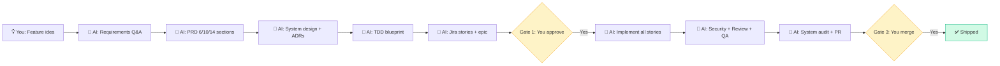

<div align="center">


# HeadMaster ADLC
### Autonomous Development Lifecycle using Claude Code

**You describe a feature. AI writes the PRD, designs the system, implements the code, runs security scans, reviews it, opens the PR. You approve and merge.**

[](https://python.org)
[](https://docs.anthropic.com/en/docs/claude-code)
[](LICENSE)

[Quick Start](#-quick-start) • [What Makes It Different](#-what-makes-headmaster-different) • [Example](#-example-45-minutes-end-to-end) 

</div>

---

## 💡 What Is HeadMaster?

**An autonomous development pipeline that turns feature descriptions into production-ready PRs.**

Traditional AI copilots assist you. **HeadMaster drives the entire SDLC** while you own the decisions.

```
You:  "Add rate limiting to public API - 100 req/min per client"

AI:   ✅ Writes PRD (10 sections)
      ✅ Designs system + architecture decisions
      ✅ Generates TDD implementation blueprint
      ✅ Creates 3 Jira stories
      
      🟡 Gate 1: You approve stories (2 min)
      
      ✅ Implements all 3 stories (code + tests)
      ✅ Runs security scan + code review (isolated agent)
      ✅ Writes + runs QA integration tests (isolated agent)
      ✅ Audits design vs actual execution
      ✅ Opens PR with rollback plan
      
      🟡 Gate 3: You merge PR (3 min)
      
You:  ✅ Shipped in 45 minutes (your time: 5 minutes)
```

**Your involvement:** 10-20 minutes across 1-2 hours of autonomous execution.

---

## 🚀 What Can HeadMaster Do?

### Core Capabilities

| Feature | What It Does | Impact |
|---------|-------------|--------|
| **🤖 Full SDLC Automation** | PRD → Design → Implementation → Testing → PR | 90% time saved vs manual |
| **🧠 Complexity Auto-Detection** | Lite (6-section PRD) → Full (14-section) based on scope | No over-engineering small features |
| **👁️ Isolated Agent Reviews** | Code reviewer sees only git diff (no implementation context) | Catches "I know what I meant" bugs |
| **🔄 Intelligent Retry Logic** | Blocks retry approaches with 70%+ word overlap to prior failures | No infinite loops |
| **🎯 Convergence Detection** | Detects oscillating review loops → auto-escalates after 3x | No "fix A breaks B" cycles |
| **💰 Cost Optimization** | Opus for design, Sonnet for code, Haiku for checklists | 60-80% savings vs "Opus everywhere" |
| **📊 Session Age Management** | Auto-checkpoint at 25 turns, auto-handoff at 35 | Handles multi-hour executions |
| **🔒 Production-Safe** | Git guard blocks force-push/hard-reset, secret scanner | No accidental data loss |

### What HeadMaster Automates (End-to-End)



---

## 🔥 What Makes HeadMaster Different?

### Claude in a Loop

| Capability | Naive Loop | HeadMaster |
|-----------|-----------|-----------|
| **Context Management** | 💥 Blows up after 3-4 stories | ✅ Distillation chain + lazy loading |
| **Review Isolation** | ❌ Reviewer knows implementation | ✅ Fresh context, diff-only |
| **Infinite Loops** | 💥 Fix A → breaks B → repeat | ✅ Convergence detection + escalation |
| **Session Crashes** | 💥 Lost work | ✅ Auto-checkpoints + recovery |
| **Token Usage** | 💸 500K+ for 5-story feature | ✅ 100-150K (lazy loading + compression) |
| **Cost** | 💸 $20-40 per feature | ✅ $5-10 per feature (model routing) |

### Key Innovations

#### 1. **Isolated Agent Reviews** (Genuine Fresh Eyes)
```
Developer agent:
  Knows: TDD section for this story
  Doesn't know: PRD, upstream design decisions, other stories

Code reviewer agent:
  Knows: Git diff only (this commit)
  Doesn't know: TDD, implementation context, why developer chose this approach
  
QA agent:
  Knows: Acceptance criteria only
  Doesn't know: Implementation, review findings

System reviewer:
  Knows: TDD design + final git log
  Doesn't know: Per-story struggles, retry history
```

**Why this matters:** Catches bugs the implementer missed due to "I know what I meant" blindness.

#### 2. **Failure Learning + Convergence Detection**
```json
{
  "STORY-123": {
    "attempts": [
      {
        "approach": "Used raw SQL concatenation",
        "error": "SQL injection detected",
        "hypothesis": "Use PreparedStatement"
      },
      {
        "approach": "Used PreparedStatement",  // ✅ 20% word overlap → allowed
        "error": "Connection pool exhausted",
        "hypothesis": "Add connection pooling"
      },
      {
        "approach": "String interpolation for query",  // ❌ 85% overlap with attempt 1 → BLOCKED
        "error": "..."
      }
    ]
  }
}
```

**Result:** No infinite retry loops. After 3 structurally different attempts → escalates to you.

#### 3. **Model Routing = 60-80% Cost Savings**
```
Task Type                  Model      Cost Multiplier
━━━━━━━━━━━━━━━━━━━━━━━━━━━━━━━━━━━━━━━━━━━━━━━━━━━━━━━
Architecture decisions     Opus 4.7   1.0x   (deep reasoning needed)
Code implementation        Sonnet 4.6 0.3x   (balanced)
PRD/reviews/QA            Sonnet 4.6 0.3x   (structured output)
Checklists/search/scan    Haiku 4.5  0.05x  (no creativity needed)

Naive (Opus everywhere):   $40 per 5-story feature
HeadMaster (model routing): $8 per 5-story feature  (80% savings)
```

#### 4. **Complexity Tiers** (Right-Sized Artifacts)
```
Feature: "Add validation to form field"
├─ Detected: Lite tier (1 repo, 1-2 stories, known pattern)
├─ PRD: 6 sections (not 14)
├─ Design: IMPLEMENTATION_BRIEF (5 sections, not TDD 11 sections)
└─ Execution: 45 minutes (not 3 hours)

Feature: "Migrate Elasticsearch 5→9 across 5 repos"
├─ Detected: Full tier (multi-repo, 8 stories, complex migration)
├─ PRD: 14 sections (stakeholders, constraints, rollback)
├─ Design: TDD_MASTER + 5 per-repo TDDs
└─ Execution: 4-6 hours
```

**Why this matters:** Small features don't get over-engineered with unnecessary documentation.

---

## ⚡ Quick Start

### 1. Install (2 minutes)

```bash
git clone <repository>
cd HeadMaster
pip install -r requirements.txt

# Configure Claude Code
cp .claude/settings.local.json.example .claude/settings.local.json
```

### 2. Configure (1 minute)

Edit `config.yml`:

```yaml
interactive: false   # Autonomous mode (only asks when confused)
jira_push: true      # Auto-push stories to Jira after Gate 1
project_key: "PROJ"  # Your Jira project key
```

Set Jira credentials (one-time):

```powershell
# Windows PowerShell
[System.Environment]::SetEnvironmentVariable("ATLASSIAN_DOMAIN", "company.atlassian.net", "User")
[System.Environment]::SetEnvironmentVariable("JIRA_USER_EMAIL", "you@company.com", "User")
[System.Environment]::SetEnvironmentVariable("JIRA_API_TOKEN", "your-token", "User")

# Restart terminal for changes to take effect
```

Get token: https://id.atlassian.com/manage-profile/security/api-tokens

### 3. Start Your First Feature (1 command)

```bash
claude --name "my-feature"
/navigate "Add rate limiting to public API - 100 req/min per client"
```

**That's it.** HeadMaster:
1. Auto-detects complexity (Lite/Standard/Full)
2. Generates PRD + design + stories
3. Waits for Gate 1 approval
4. Implements all stories autonomously
5. Opens PR

**Typical timeline:** 45 minutes to 2 hours (depending on feature size).

---

## 📊 Example: 45 Minutes End-to-End

### Input (30 seconds)
```bash
claude --name "api-rate-limit"
/navigate "Add rate limiting to public API - 100 req/min per client"
```

### AI Execution (Autonomous)

**[0:00 - 0:05] Plan** *(5 min)*
```
✅ Classified: Standard tier (3-5 stories, 1 repo)
✅ PRD: 10 sections generated
✅ Discovery: Redis already used → reuse for rate limit store
✅ Review: 0 blockers
```

**[0:05 - 0:15] Design** *(10 min)*
```
✅ Architecture: Token bucket algorithm
✅ ADR-1: Redis over in-memory (multi-instance requirement)
✅ TDD: 8 sections, 3 vertical slices
✅ Review: 0 blockers
```

**[0:15 - 0:17] Breakdown** *(2 min)*
```
✅ 3 stories:
   • PROJ-101: Rate limit middleware (3 SP)
   • PROJ-102: Redis token bucket impl (2 SP)
   • PROJ-103: API response headers (1 SP)
✅ Epic: PROJ-100 created
```

**[0:17 - 0:19] Gate 1** *(you: 2 min)*
```
🟡 Review story list → approve/revise
```
👉 **You:** ✅ Approve

**[0:19 - 0:44] Execute** *(25 min, autonomous)*
```
PROJ-101: Middleware
  ✅ Implement (3 commits)
  ✅ Security (0 secrets, 0 CVEs)
  ✅ Review (0 critical/high findings)
  ✅ QA (3/3 ACs pass)
  
PROJ-102: Token bucket
  ✅ Implement (2 commits)
  ✅ Security ✅ Review ✅ QA (2/2 ACs)
  
PROJ-103: Headers
  ✅ Implement (1 commit)
  ✅ Security ✅ Review ✅ QA (1/1 ACs)

System Review:
  ✅ 0 design divergences
  ✅ 0 actionable findings
  
✅ PR created: feature/api-rate-limit → main
```

**[0:44 - 0:47] Gate 3** *(you: 3 min)*
```
🟡 Review PR → merge
```
👉 **You:** ✅ Merge

**Total:** Your time: **5 minutes** | AI time: **42 minutes** | End-to-end: **47 minutes**

---

## 🎯 The 3-Gate Workflow

HeadMaster only stops at 3 checkpoints. Everything else runs autonomously.

| Gate | When | You Do | AI Did Before This |
|------|------|--------|--------------------|
| **Gate 1: Stories** | After breakdown | Review story list (2 min)<br>Approve / revise / defer | • Generated PRD (6/10/14 sections)<br>• Designed system + ADRs<br>• Created TDD blueprint<br>• Broke into 1-10 stories<br>• Pushed to Jira (optional) |
| **Gate 2: Escalation** | Story failed 3x<br>*(rare)* | Investigate root cause (5-10 min)<br>Fix manually → resume | • Tried 3 structurally different approaches<br>• Logged failure reasons + hypotheses<br>• Detected convergence loop |
| **Gate 3: PR** | All stories done | Review PR (5 min)<br>Merge to main | • Implemented all stories<br>• Security scan + code review<br>• QA integration tests<br>• System audit (design vs actual)<br>• Generated rollback plan |

**What you DON'T do:**
- ❌ Answer 50 requirements questions
- ❌ Write PRD sections manually
- ❌ Design architecture
- ❌ Write story descriptions
- ❌ Implement code
- ❌ Write tests
- ❌ Run security scans
- ❌ Review code
- ❌ Create Jira tickets
- ❌ Approve every commit

---

## 💰 Cost Optimization

HeadMaster uses **model routing** to minimize cost without sacrificing quality:

```
Typical 5-story feature:
━━━━━━━━━━━━━━━━━━━━━━━━━━━━━━━━━━━━━━━━━━━━━━━━━━━━━━━
Naive (Opus everywhere):        $35-50
HeadMaster (model routing):     $6-10    (85% savings)

Breakdown:
  Opus 4.7 (30K tokens):        $2   (architecture only)
  Sonnet 4.6 (120K tokens):     $6   (code, PRD, reviews)
  Haiku 4.5 (50K tokens):       $0.50 (checklists, search)
  Scripts (0 tokens):           $0   (gate checks, compression)
```

Additional optimizations:
- **Complexity tiers:** Lite features use 6-section PRD (not 14)
- **Lazy loading:** Skills load stages on-demand (~300 tokens saved/invocation)
- **Read compression:** Memory files compressed 30-60% before Claude sees them
- **Stop hooks:** Python scripts replace Haiku calls for deterministic checks
- **Context discipline:** Each phase loads only required artifacts

**Result:** 100K-150K tokens for full pipeline (vs 500K+ naive approach).

---

## 🛡️ Reliability Features

### Git Guard (Production-Safe)
```python
❌ Blocked:
  git push --force
  git reset --hard
  git clean -fd
  git checkout -- .
  git restore .
  
✅ Allowed:
  git push origin story/PROJ-123
  git commit / add / branch / diff
```

### Crash Recovery
```bash
# Session died mid-execution?
/execute my-feature  # Resume command

# Pre-flight checks:
✅ Branch integrity (dirty working tree → stash/reset)
✅ Build status (broken → soft reset HEAD~1)
✅ Task list sync (resume from last completed story)
```

### Intelligent Retry Logic
```
Attempt 1: SQL concatenation → SQL injection detected
Attempt 2: PreparedStatement → ✅ Structurally different (allowed)
Attempt 3: String interpolation → ❌ 85% word overlap with attempt 1 (BLOCKED)
           → Escalate to Gate 2
```

### Convergence Detection
```
Iteration 1: Fixed blocker A
Iteration 2: Fixed blocker B
Iteration 3: Blocker A reappeared (oscillation detected)
            → Auto-escalate to Gate 2
```

### Session Age Management
```
🟡 5 turns → Notice (keep working)
🟠 10 turns → Auto-checkpoint saved (keep working)
⛔ 15 turns → Auto-handoff + terminate

Heavy reads (>500KB) trigger earlier thresholds.
Auto-braindump at 🟠 provides recovery point.
```

---

## 📊 Complexity Tiers (Auto-Detected)

Not every feature needs a 14-section PRD. HeadMaster auto-classifies:

| Tier | Stories | Repos | PRD Sections | Design | Example |
|------|---------|-------|--------------|--------|---------|
| **🟢 Lite** | 1-2 | 1 | 6 | IMPLEMENTATION_BRIEF (5 sections) | "Add validation to form field" |
| **🟡 Standard** | 3-5 | 1-2 | 10 | TDD.md (8 sections) | "Add export feature with 3 formats" |
| **🔴 Full** | 6+ | 2+ | 14 | TDD_MASTER + per-repo TDDs | "Migrate Elasticsearch 5→9 across 5 repos" |

**Override:** `/navigate my-feature --tier lite` (if AI misclassifies)

**Why tiers matter:**
- Lite features ship in 30-60 minutes (not 3 hours)
- No over-engineering small changes
- Documentation matches complexity

---

## 🧠 Memory Architecture

HeadMaster uses 3 separate memory systems:

### 1. Feature Memory (Per-Feature)
```
memory/features/{slug}/
├── loop_state.json              # Pipeline phase, iteration, tier
├── session-{timestamp}.md       # Manual handoffs (/handoff)
├── session-{timestamp}-auto.md  # Auto-checkpoints (🟠 threshold)
└── agents/
    ├── developer.md             # Retry history per story
    ├── qa-engineer.md           # Test patterns
    └── review-agent.md          # Review findings
```
**Lifecycle:** Created during feature, **discarded after ship**

### 2. Agent Memory (Cross-Feature)
```
.claude/agent-memory/
├── developer/           # Codebase conventions, build quirks
├── codebase-analyst/    # Module boundaries, patterns
└── web-researcher/      # API research history
```
**Lifecycle:** Automatic, **persists across features** (agent learnings)

### 3. Auto-Memory (Project Context)
```
.claude/memory/
├── user/                # Your role, preferences, knowledge level
├── feedback/            # Workflow guidance (avoid/repeat)
├── project/             # Ongoing work, goals, deadlines
└── reference/           # External systems (Linear, Grafana)
```
**Lifecycle:** Automatic, **persists across features** (project context)

---

## 📊 Performance Monitoring

HeadMaster includes passive performance monitoring:
- Tracks phase durations, loop iterations, tool usage
- Compares to baselines, alerts on regressions  
- Zero user friction (runs in background)

**View dashboard:**
```bash
claude -p "/skill-monitor dashboard"
```

**Configuration:** See `config.yml` → `skill_monitoring` section.  
**Disable:** Run `bash scripts/disable_monitoring.sh`  
**Details:** See `docs/MONITORING_QUICK_START.md`

---

## 🐛 Troubleshooting

| Problem | Solution |
|---------|----------|
| **Feature not resuming** | `/navigate {slug}` — detects phase from artifacts |
| **Undo changes** | `Esc + Esc` → checkpoint picker |
| **Review loop stuck** | Check `memory/features/{slug}/loop_state.json` → iteration count |
| **Jira push failing** | Verify env vars: `echo $env:JIRA_USER_EMAIL` |
| **Story failed 3x** | Check `execution/reviews/escalation-{STORY}.md` |
| **Session age ⛔** | Run `/handoff` at 🟠, or increase `turn_warn_red` in config |
| **Hook errors** | Status shows ⚠️, check `~/memory/hook-errors.log` |

---

## 🏗️ Architecture Highlights

### Single Source of Truth (Distillation Chain)
```
Raw input → FEATURE_DRAFT.md → PRD.md (approved)
  ↓
PRD.md → SYSTEM_DESIGN_NOTES.md → TDD.md (approved)
  ↓
TDD.md → JIRA_BREAKDOWN.md (approved)
  ↓
JIRA_BREAKDOWN.md → Per-story implementation

Each phase distills upstream work.
Once distilled, upstream artifacts are never reloaded.
Result: Context stays bounded even on 10-story features.
```

### Isolated Agents (Fresh Eyes)
```
Developer:       Knows TDD section only
Code Reviewer:   Knows git diff only (no TDD, no context)
QA Engineer:     Knows ACs only (no code, no review findings)
System Reviewer: Knows TDD + git log (finds design divergences)

Why? Prevents "I know what I meant" blindness.
```

### Deterministic Gates (Python > Haiku)
```
Python scripts:  0 tokens, <50ms, 100% consistent
Haiku agents:    ~500 tokens, ~2s, 95% consistent

Gate checks use Python. Only spawn agents when judgment required.
```

---

## 🚀 Get Started Now

```bash
git clone <repository>
cd HeadMaster
pip install -r requirements.txt
cp .claude/settings.local.json.example .claude/settings.local.json

# Edit config.yml:
#   interactive: false
#   jira_push: true
#   project_key: "YOUR_PROJECT"

# Set Jira env vars (see Quick Start)

claude --name "my-feature"
/navigate "describe your feature"
```

**HeadMaster takes it from there.**

---

<div align="center">
**Issues?** [Open an issue](https://github.com/munna-chauhan/HeadMaster/issues)  
**Improvements?** Contributions welcome

**License:** Apache License
**Requirements:** Claude Code, Python 3.10+  
**Optional:** Jira (for story push), Confluence (for input fetch)
</div>
