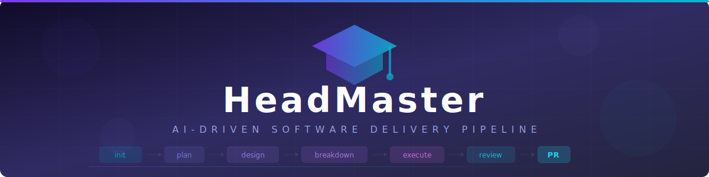

<p align="center">
  <picture>
    <source media="(prefers-color-scheme: dark)" srcset=".github/assets/banner.svg">
    <source media="(prefers-color-scheme: light)" srcset=".github/assets/banner.svg">
    
  </picture>
</p>

<p align="center">
  
  
  
  
  
  
</p>

<p align="center">
  <strong>AI-driven software delivery pipeline that turns a conversation into production-ready code.</strong>
  <br>
  <em>Plan. Design. Build. Review. Ship. &mdash; All from Claude Code.</em>
</p>

<p align="center">
  <a href="#quick-start">Quick Start</a> &bull;
  <a href="#pipeline-at-a-glance">Pipeline</a> &bull;
  <a href="#skills--all-commands">Commands</a> &bull;
  <a href="#full-pipeline-walkthrough">Walkthrough</a> &bull;
  <a href="#configuration-reference">Config</a> &bull;
  <a href="#troubleshooting">Help</a>
</p>

---

## What It Does

HeadMaster is an orchestration layer that sits **alongside** your feature repositories. You open Claude Code from the HeadMaster directory, point it at a project, and run slash commands to move features through the pipeline.

```
  /init-feature  -->  /plan  -->  /design  -->  /breakdown  -->  /execute  -->  PR
       |               |            |              |               |            |
   Route & Tier     PRD.md      TDD.md        Jira Stories    Code + Tests   Merge
```

Each stage produces structured, human-reviewable artifacts. **Nothing merges automatically. Every gate requires explicit approval.**

**What it automates:** requirements elicitation, PRD authoring, architecture decisions, TDD blueprints, Jira story decomposition, test-first implementation, security scanning, code review, QA testing, and cross-story system review.

**What it does not do:** deploy, auto-merge, or skip human approval gates.

---

## Quick Start

### 1. Clone & Configure

```bash
git clone <headmaster-repo> HeadMaster && cd HeadMaster
cp config.yml.example config.yml
```

Edit `config.yml` — set `projects.active` and add your project entry with a real `root` path.

### 2. Resolve project paths

```bash
python scripts/setup_projects.py
```

Creates `docs/features/{project}/`, `memory/features/{project}/`, and writes `.claude/settings.local.json` (gitignored) with the resolved project root for `additionalDirectories` and per-project Write rules. Re-run after editing `config.yml`.

### 3. Install MCP Servers

```bash
npx -y @xuandev/atlassian-mcp    # Jira + Confluence
npx @drawio/mcp                  # Diagrams
```

### 4. Launch

```bash
claude
```

### 5. Build Something

```bash
/init-feature "Add PDF invoice export with GDPR compliance"
/plan invoice-pdf-export
/design invoice-pdf-export
/breakdown invoice-pdf-export
/execute invoice-pdf-export
```

Verify state at any time: `python scripts/state_manager.py --status`.

<details>
<summary><strong>Prerequisites</strong></summary>

| Requirement | Version | Notes |
|---|---|---|
| [Claude Code](https://claude.ai/code) | Latest | CLI or desktop app |
| Python | 3.9+ | For orchestration scripts |
| Node.js | 18+ | **Required** — hooks use `node` for cross-platform Python resolution |
| Git | Any | For story branches and commits |
| Jira access | Optional | Required only if `jira_push: true` |

**Environment variables** (required for Jira integration):

```bash
ATLASSIAN_DOMAIN=your-org.atlassian.net
JIRA_USER_EMAIL=you@yourcompany.com
JIRA_API_TOKEN=your-api-token
```

Set these in your shell profile. HeadMaster never stores credentials.

</details>

---

## Pipeline at a Glance

### Routes

| Route | When to use | Pipeline |
|---|---|---|
| `feature` | New functionality | Full: plan &rarr; design &rarr; breakdown &rarr; execute |
| `hotfix` | Targeted bug fix | Compressed: optional design skip |
| `epic` | Multi-phase initiative | Plan-only or full |
| `spike` | Research / feasibility | Plan only &rarr; `RESEARCH_REPORT.md` |

### Tiers

Auto-detected during `/init-feature`. Controls artifact depth and which reviews are required.

| Tier | Stories | Points | PRD | Design | Reviews |
|---|---|---|---|---|---|
| **XS** | 1-2 | 1-5 | Skip | `IMPLEMENTATION_BRIEF.md` | Optional |
| **S** | 3-5 | 6-15 | Required | `TDD.md` | Optional |
| **M** | 5-8 | 13-21 | Required | `SYSTEM_DESIGN_NOTES` + `TDD.md` | Required |
| **L** | 9+ | 22+ | Required | Full design + `TDD_MASTER` | Required |

### State Machine

Every feature has a `loop_state.json` in `memory/features/{project}/{slug}/` — the single source of truth. Tracks current phase, per-stage status (`planning_stages`, `design_stages`), artifact statuses, story progress, gate timestamps, and retry counts. Never edit manually; use `gate_transition.py` for transitions.

### Human Gates

**Unconditional** (never auto-approve): PRD approval, TDD approval, Jira story approval, Merge Gate.

**Configurable**: PRD review mode, TDD review mode, breakdown auto-approve. See `config.yml` gates section.

---

## Skills &mdash; All Commands

### Primary Pipeline

<table>
<tr><td width="200"><code>/init-feature</code></td><td>

Start here. Detects route, classifies tier, scaffolds directories, creates `loop_state.json`.

```bash
/init-feature "Add PDF invoice export with GDPR compliance"
/init-feature spike "Is ElasticSearch viable for replacing Lucene?"
/init-feature hotfix "Fix null pointer in payment processor"
/init-feature path/to/FEATURE_INPUT.md
```

</td></tr>
<tr><td><code>/plan &lt;slug&gt;</code></td><td>

Drives planning to an approved PRD. Auto-resumes from saved stage state.

```bash
/plan invoice-pdf-export
/plan invoice-pdf-export "the async path needs more detail"
```

**Stages:** Context (codebase scan) &rarr; Discover (gap Q&A, inline) &rarr; Draft (PRD authoring, inline) &rarr; **stop** &rarr; Review (new session, interactive)

Draft and Review run in separate sessions. After Draft completes, start a new session and re-run `/plan {slug}` to begin the interactive review.

</td></tr>
<tr><td><code>/design &lt;slug&gt;</code></td><td>

Drives design to an approved TDD. Reads PRD. Auto-resumes.

```bash
/design invoice-pdf-export
/design invoice-pdf-export "focus on caching strategy"
```

**Stages:** Architect (ADRs + design notes) &rarr; Engineer (TDD blueprint) &rarr; **stop** &rarr; Review (new session, inline)

</td></tr>
<tr><td><code>/breakdown &lt;slug&gt;</code></td><td>

Decomposes TDD into Jira stories with ACs and sizing.

```bash
/breakdown invoice-pdf-export
/breakdown invoice-pdf-export merge-gate   # standalone pre-merge check
```

</td></tr>
<tr><td><code>/execute &lt;slug&gt;</code></td><td>

Drives all stories through implementation, scan, review, QA, and creates PR.

```bash
/execute invoice-pdf-export
/execute invoice-pdf-export --story ACME-101   # one story only
```

</td></tr>
</table>

### Per-Story Execution Phases

| Phase | Scope | Agent | What | Isolated |
|:---:|---|---|---|:---:|
| **A** | Per story | `developer` (inline) | Implement per TDD + security scan | |
| **B** | Per story | Parent (inline) | Verify diff covers all ACs | |
| **C** | Feature (once) | `review-agent` + `qa-engineer` (parallel subagents) | System review + integration QA | **Yes** |

Phase C runs once after all stories complete. Any blocking findings → escalate before PR.

### Supporting Skills

<details>
<summary><strong>Click to expand all supporting commands</strong></summary>

#### `/implement <slug> <story-key>`
Phase A only. Implements a single story inline.

#### `/security-scan <slug> <story-key>`
Standalone. Runs `diff_scanner.py` against a branch diff. Embedded in Phase A.

#### `/review-code <slug> <story-key>`
Standalone code review skill. Reviews a branch diff — TDD compliance, OWASP, logic.

#### `/qa-integration <slug> <story-key>`
Standalone. Writes + runs integration tests. Used as subagent in Phase C.

#### `/review-system <slug>`
Standalone. Process audit subagent — TDD design vs actual execution. Used in Phase C.

#### `/jira-ops <action> <target> [payload]`

All Jira communication. MCP-first, manual fallback.

```bash
/jira-ops create-epic invoice-pdf-export
/jira-ops create-story ACME-100 "Add PDF generation endpoint"
/jira-ops transition ACME-101 "In Progress"
/jira-ops comment ACME-101 "Phase A complete, branch: story/ACME-101"
/jira-ops link ACME-101 blocks ACME-102
```

#### `/reopen <slug> [stage] [message]`

Reopen a completed stage for revision. Cascades downstream.

```bash
/reopen invoice-pdf-export planning "PRD section 3 is missing auth flow"
/reopen invoice-pdf-export design "TDD missing error handling for timeout"
```

Cascade: `planning` reopened &rarr; design, breakdown, execute marked `revision`.

#### `/publish-confluence <slug> <artifact>`
Publish PRD or TDD to Confluence.

#### `/archive-feature <project> <slug>`
Move a completed feature to archive.

#### `/retrospect <slug>`
Analyze completed run. Auto-applies agent memory patches and pipeline learnings. Config proposals require human approval.

#### `/compress <filepath>`
Compress a working `.md` file to concise style. Saves input tokens.

#### `/draw "description" [--format png|svg|pdf] [-o path]`
Generate architecture or flow diagrams as native `.drawio` files.

</details>

### Setup

```bash
/setup-env [--project <name>] [--reset]
```

Scan project repos, detect tech stack per module, write `memory/projects/{project}/repo-registry.yml`. **Run once per project before `/init-feature`** — enables repo/module selection without live scanning on every feature. Re-run with `--reset` after repo structure changes.

---

### Standalone Reviews

Three skills run independently &mdash; no active feature or loop state required.

| Command | What it does |
|---|---|
| `/review-pr <number-or-url>` | Review an open GitHub PR (quality + OWASP + logic) |
| `/review-branch [branch] [--base main]` | Review full branch diff against base |
| `/review-tdd <path> [--prd <path>]` | Review TDD for completeness + optional PRD traceability |

---

## Full Pipeline Walkthrough

A complete `s`-tier feature from start to PR.

<details>
<summary><strong>Step 1 &mdash; Initialize</strong></summary>

```
/init-feature "Add full-text search to the product catalog"
```

HeadMaster asks clarifying questions (codebase, effort, complexity, dependencies), then outputs:

```
Feature initialized: product-catalog-search
Route:  feature
Tier:   s
Next: /plan product-catalog-search
```

</details>

<details>
<summary><strong>Step 2 &mdash; Plan (two sessions)</strong></summary>

**Session 1 — Authoring**
```
/plan product-catalog-search
```

- **Context** &mdash; codebase-analyst scans for existing search patterns, indexing code, data models.
- **Discover** &mdash; requirements-analyst (inline) surfaces gaps one question at a time: fuzzy matching required? searchable fields? response time SLA?
- **Draft** &mdash; prd-author (inline) writes `PRD.md`.

Stops automatically. Prints: `PRD written. Start a new session: /plan product-catalog-search to review.`

**Session 2 — Review**
```
/plan product-catalog-search
```

- **Step 1** &mdash; "Any feedback on the PRD?" &rarr; apply or skip
- **Step 2** &mdash; targeted Q&A on scope, requirements, AC testability (3 questions for s-tier)
- **Step 3** &mdash; open floor: "Any other questions or concerns?"
- **Step 4** &mdash; optional sections gate: "Add security requirements? Observability targets? Performance SLOs?" — user decides, none added by default
- **Step 5** &mdash; prd-reviewer (inline, m/l only) mechanical checklist pass

PRD approved &rarr; advance to `/design`.

</details>

<details>
<summary><strong>Step 3 &mdash; Design</strong></summary>

```
/design product-catalog-search
```

**Architect** &mdash; reads PRD + codebase. Decides: use existing ES client, add `FullTextSearchService`, index on product write, query via `GET /catalog/search?q=`. Writes `SYSTEM_DESIGN_NOTES.md` with ADRs.

**Engineer** &mdash; reads locked design. Writes `TDD.md`: interfaces, data models, component design, error handling, testing strategy, vertical slices, ADR references.

Engineer stops. Start a new session and re-run `/design product-catalog-search` to begin Review.

**Review** &mdash; tdd-reviewer reads TDD cold. Verifies interface-to-AC traceability, ADR alignment, error path enumeration. Returns `APPROVED`.

</details>

<details>
<summary><strong>Step 4 &mdash; Breakdown</strong></summary>

```
/breakdown product-catalog-search
```

release-agent decomposes TDD into stories. You approve. If `jira_push: true`, it creates the epic + stories in Jira.

</details>

<details>
<summary><strong>Step 5 &mdash; Execute</strong></summary>

```
/execute product-catalog-search
```

For each story: Phase A (implement + scan) &rarr; Phase B (AC check). Phase C (system review + integration QA) runs once after all stories complete.

</details>

<details>
<summary><strong>Step 6 &mdash; PR</strong></summary>

`/execute` finishes with automatic PR creation. Human reviewer merges. Feature complete.

</details>

---

## Tier Workflows

<details>
<summary><strong>XS &mdash; Trivial Fix</strong> (skips PRD, design notes, all reviews)</summary>

```bash
/init-feature hotfix "Fix null pointer in PaymentService"
# -> tier: xs
/design my-fix          # writes IMPLEMENTATION_BRIEF.md only
/execute my-fix         # A -> B per story, no Phase C
```

</details>

<details>
<summary><strong>S &mdash; Standard Feature</strong> (PRD + TDD, reviews optional)</summary>

```bash
/init-feature "Add user profile avatar upload"
/plan my-feature
/design my-feature
/breakdown my-feature
/execute my-feature
```

</details>

<details>
<summary><strong>M &mdash; Multi-Story</strong> (all artifacts + reviews required)</summary>

```bash
/init-feature "Add real-time notifications"
/plan my-feature
/design my-feature      # SYSTEM_DESIGN_NOTES + TDD + required review
/breakdown my-feature
/execute my-feature     # A -> B (per story) + Phase C (system review + QA) -> PR
```

</details>

<details>
<summary><strong>L &mdash; Large / Multi-Repo</strong> (full depth, TDD splits by repo)</summary>

```bash
/init-feature "Migrate from MySQL to PostgreSQL"
/plan my-feature
/design my-feature      # 13-section design + TDD_MASTER + TDD_{REPO} per repo
/breakdown my-feature   # JIRA_BREAKDOWN_{REPO} per repo
/execute my-feature
```

</details>

<details>
<summary><strong>Spike &mdash; Research Only</strong></summary>

```bash
/init-feature spike "Evaluate GraphQL vs REST for the API gateway"
/plan my-spike          # FEATURE_DRAFT -> DISCOVERY -> RESEARCH_REPORT.md
# Pipeline ends here.
```

</details>

---

## Agents

13 specialized agents, each with defined input/output contracts and memory.

### Planning

| Agent | Model | Role | Pattern |
|---|:---:|---|---|
| `requirements-analyst` | haiku | Requirements elicitation, gap surfacing | Inline always |
| `prd-author` | haiku | PRD authoring from discovery | Inline always |
| `prd-reviewer` | haiku | PRD mechanical checklist (m/l tiers) | Inline in review session |

### Design

| Agent | Model | Role | Pattern |
|---|:---:|---|---|
| `solutions-architect` | opus | Architecture decisions, ADRs, design notes | Inline |
| `codebase-analyst` | haiku | Codebase scanning | Subagent (read-only) |
| `tdd-author` | haiku | TDD blueprints from design notes | Inline |
| `tdd-reviewer` | haiku | TDD stress-test | Inline in review session |
| `web-researcher` | sonnet | External library / API research | Subagent |

### Execution

| Agent | Model | Role | Pattern |
|---|:---:|---|---|
| `developer` | sonnet | Test-first implementation, atomic commits | Inline |
| `review-agent` | haiku | Code review + OWASP security (diff only) | Subagent (isolated) |
| `qa-engineer` | sonnet | Integration tests per AC, test fixes | Subagent (isolated) |
| `release-agent` | haiku | Story decomposition + merge gate | Inline |
| `retrospective-analyst` | haiku | Post-feature pattern extraction, memory + learning proposals | Subagent |

**Isolation:** review-agent, qa-engineer, tdd-reviewer receive **no implementation context** — diff + ACs + TDD sections only. Enforced by `pre_spawn_validation.py` hook. prd-reviewer isolation is structural (new session).

---

## Configuration Reference

The canonical reference is [`config.yml.example`](config.yml.example). Copy it to `config.yml` (gitignored) and customize. Every key in the example file has a consumer — no dead keys.

```bash
cp config.yml.example config.yml
```

Validate your config at any time:

```bash
python scripts/config_utils.py validate config.yml
```

**`gates.{phase}.interactive`** — `true` asks at decision points, `false` lets the agent decide and document reasoning. Per-phase only — there is no global `pipeline.interactive`.

**`gates.{phase}.review.mode`**

| Mode | Behavior |
|---|---|
| `skip` | Mark artifact APPROVED immediately |
| `auto` | Run reviewer inline, auto-approve PASS/CONDITIONAL |
| `human_in_loop` | Interactive Q&A + reviewer (m/l tiers) |

<details>
<summary><strong><code>.mcp.json</code> &mdash; MCP server config</strong></summary>

```json
{
  "mcpServers": {
    "atlassian": {
      "command": "npx",
      "args": ["-y", "@xuandev/atlassian-mcp"],
      "env": {
        "ATLASSIAN_DOMAIN": "${ATLASSIAN_DOMAIN}",
        "ATLASSIAN_EMAIL": "${JIRA_USER_EMAIL}",
        "ATLASSIAN_API_TOKEN": "${JIRA_API_TOKEN}"
      }
    },
    "drawio": {
      "command": "npx",
      "args": ["@drawio/mcp"]
    }
  }
}
```

Environment variables are resolved at runtime. Never put actual values in this file.

</details>

---

## Working on Multiple Projects

### Add a Project

```yaml
projects:
  active: beta
  beta:
    name: Beta
    root: ../beta-app
    project_key: BETA
    jira_push: false
    coverage_threshold: 75
```

### Switch Active Project

Change `projects.active` in `config.yml`, re-run `python scripts/setup_projects.py` (refreshes `.claude/settings.local.json`), then restart your Claude Code session.

All feature directories are isolated by project:

```
docs/features/acme/{slug}/      <- Acme features
docs/features/beta/{slug}/      <- Beta features
memory/features/acme/{slug}/    <- Acme state
memory/features/beta/{slug}/    <- Beta state
```

### Check All Feature States

```bash
python scripts/state_manager.py --status
python scripts/state_manager.py --status --project acme
```

---

## Resuming an Interrupted Feature

Every skill auto-detects where it left off. Just re-run the command:

```bash
/plan product-catalog-search        # resumes at the interrupted stage
/design product-catalog-search
/execute product-catalog-search     # resumes from the incomplete story
```

---

## Handling Failures & Rollback

<details>
<summary><strong>Phase A &mdash; Implementation Failures</strong></summary>

Max 3 attempts before human escalation. `failure_ledger.py` prevents retrying the same broken approach.

```bash
python scripts/failure_ledger.py load acme product-catalog-search ACME-201
```

</details>

<details>
<summary><strong>Phase C &mdash; System Review + QA Failures</strong></summary>

| Agent | Verdict | Action |
|---|---|---|
| `review-agent` | `FINDINGS` (CRITICAL/HIGH) | Fix in-place on feature branch or re-dispatch story |
| `qa-engineer` | `REJECTED-BUG` | Fix code (never the test), Phase C re-runs once |
| `qa-engineer` | `APPROVED_PARTIAL` | Some ACs `NOT_VERIFIABLE` — acceptable, proceed |

</details>

<details>
<summary><strong>Reopening a Completed Stage</strong></summary>

```bash
/reopen product-catalog-search planning "NFR for response time is wrong, should be p99 not p95"
```

Cascades downstream: PRD &rarr; `revision`, design/breakdown/execute &rarr; `revision`.

</details>

<details>
<summary><strong>Emergency Reset</strong></summary>

```bash
python scripts/cleanup_failed_run.py acme product-catalog-search
python scripts/cleanup_failed_run.py acme product-catalog-search --reset-state
```

</details>

---

## Scripts

All orchestration scripts live in `scripts/`. Browse the directory for the full list — each script has a docstring at the top describing its purpose and usage. Key entry points are referenced inline throughout this README (state, recovery, failure ledger, setup).

---

## Project Structure

<details>
<summary><strong>Full directory tree</strong></summary>

```
HeadMaster/
|
+-- config.yml                        # Active project + pipeline settings
+-- .mcp.json                         # MCP servers (Atlassian, Draw.io)
|
+-- .claude/
|   +-- CLAUDE.md                     # Core operating rules
|   +-- settings.json                 # Permissions + hooks
|   |
|   +-- agents/                       # 13 agent definitions
|   |   +-- requirements-analyst.md
|   |   +-- prd-author.md
|   |   +-- prd-reviewer.md
|   |   +-- solutions-architect.md
|   |   +-- codebase-analyst.md
|   |   +-- tdd-author.md
|   |   +-- tdd-reviewer.md
|   |   +-- developer.md
|   |   +-- review-agent.md
|   |   +-- qa-engineer.md
|   |   +-- release-agent.md
|   |   +-- web-researcher.md
|   |   +-- retrospective-analyst.md
|   |   +-- references/               # Output protocols
|   |
|   +-- skills/                       # 19 skill definitions
|   |   +-- init-feature/ | plan/ | design/ | breakdown/ | execute/
|   |   +-- implement/ | security-scan/ | review-code/ | qa-integration/
|   |   +-- review-system/ | jira-ops/ | reopen/ | retrospect/
|   |   +-- publish-confluence/ | archive-feature/ | compress/ | draw/
|   |
|   +-- workflows/                    # Tier algorithms (xs/s/m/l)
|   +-- hooks/                        # Auto-run on session events
|       +-- pyrun.js                  # Cross-platform Python resolver (node)
|       +-- pre_spawn_validation.py   # Subagent isolation enforcement
|       +-- write_guard.py            # Secret detection on writes
|       +-- subagent_stop.py          # Subagent output validation
|       +-- activate.py              # Session startup
|       +-- feature_context.py       # Active feature context loader
|
+-- scripts/                          # Python orchestration
+-- docs/features/{project}/{slug}/   # Artifacts (PRD, TDD, reviews)
+-- memory/features/{project}/{slug}/ # State (loop_state.json, failure ledger)
+-- tests/
```

</details>

---

## Troubleshooting

<details>
<summary><strong>Hooks not running / <code>python: command not found</code></strong></summary>

Hooks use `node .claude/hooks/pyrun.js` which resolves `python3 → python → py` automatically. Requires Node.js 18+.

```bash
node --version     # must be 18+
python3 --version  # must be 3.9+
```

If Node.js is missing: `brew install node` (macOS) or download from nodejs.org.
</details>

<details>
<summary><strong><code>loop_state.json not found</code></strong></summary>

Run `/init-feature` first. It scaffolds all directories and creates `loop_state.json`.
</details>

<details>
<summary><strong><code>config.yml not found</code></strong></summary>

Run Claude Code from the HeadMaster root directory, not from a feature repo. If `config.yml` does not exist, copy it from the example: `cp config.yml.example config.yml`.
</details>

<details>
<summary><strong>Read/Write blocked for files in the feature repo</strong></summary>

`.claude/settings.local.json` controls `additionalDirectories` and per-project Write rules. It is generated from `config.yml` by `scripts/setup_projects.py` — re-run it after editing `config.yml.projects.{slug}.root` or adding a new project.
</details>

<details>
<summary><strong>Jira MCP unavailable</strong></summary>

1. Check env vars: `echo $ATLASSIAN_DOMAIN && echo $JIRA_USER_EMAIL`
2. Set `jira_push: false` in `config.yml` to work locally without Jira.
</details>

<details>
<summary><strong>PRD gate not triggering</strong></summary>

The gate string must appear verbatim in the PRD header table: `PRD Status: APPROVED` (case-sensitive).
</details>

<details>
<summary><strong>Review returned REJECTED</strong></summary>

1. Read `docs/features/{project}/{slug}/planning/PRD_REVIEW.md`
2. Fix `BLOCKER` items; `HIGH` should be fixed; `MEDIUM` is your call
3. Run `/plan {slug} "corrections: [describe what changed]"` in the review session
</details>

<details>
<summary><strong>Story stuck at 3 retries</strong></summary>

```bash
python scripts/failure_ledger.py load acme {slug} {STORY-KEY}
```

Review `excluded_approaches`. Use `/reopen {slug} breakdown` to revise scope or `/reopen {slug} design` if the TDD interface is unimplementable.
</details>

<details>
<summary><strong>Stale file lock on loop_state.json</strong></summary>

```bash
python scripts/gate_transition.py acme {slug} rollback
# If backup is also corrupted:
python scripts/cleanup_failed_run.py acme {slug} --reset-state
```
</details>

<details>
<summary><strong>Context window approaching limit</strong></summary>

```bash
/handoff    # saves session state and clears context
```
</details>

---

## Who Can Use This

HeadMaster today is built for a **senior developer working solo**: one Claude Code session, one or more sibling repos, all state machine-local.

- `config.yml`, `memory/`, and `.claude/settings.local.json` are gitignored — per-machine
- Jira credentials are personal env vars
- Each pipeline stage runs independently given its required upstream artifact (`/plan`, `/design`, `/breakdown`, `/execute` all resume from `loop_state.json`)
- Standalone skills (`/review-pr`, `/review-branch`, `/review-tdd`, `/scan`) need no active feature

Team rollout (architect owns `plan`/`design`; developers pick up `breakdown`/`execute`) is captured in [`FUTURE.md`](FUTURE.md) and not implemented yet.

---

## Best Practices

| # | Practice |
|:---:|---|
| 1 | **Always start with `/init-feature`** &mdash; sets tier, route, and pipeline mode correctly |
| 2 | **Read every artifact before continuing** &mdash; catching issues in PRD/TDD is far cheaper than in execution |
| 3 | **Keep `jira_push: false` until Jira is configured** &mdash; push manually with `/jira-ops` when ready |
| 4 | **Review runs in a new session** &mdash; both `/plan` and `/design` stop after authoring; re-run in a fresh session for structural isolation |
| 5 | **Use `--story` for spot-fixes** &mdash; `/execute {slug} --story ACME-101` then resume the full run |
| 6 | **Never edit `loop_state.json` manually** &mdash; use `gate_transition.py` for transitions |
| 7 | **`/reopen` instead of editing artifacts** &mdash; tracks cascade and triggers revision mode |
| 8 | **One active project per session** &mdash; change `projects.active` and restart |
| 9 | **Security/observability/metrics are opt-in** &mdash; offered during PRD review, never auto-added |
| 10 | **Phase C is mandatory for m/l tiers** &mdash; the only audit comparing intent (TDD) to outcome (commits) |

---

<p align="center">
  <sub>Built with Claude Code &bull; Orchestrated by HeadMaster</sub>
</p>
