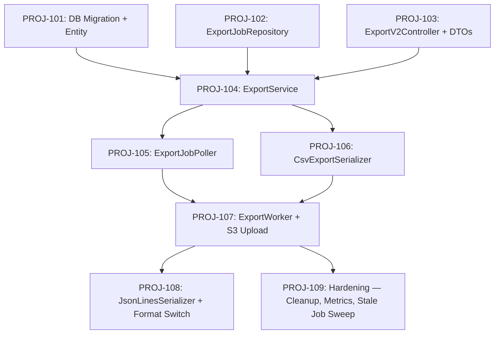

# Jira Story Breakdown: Inventory Management Service

**Technical Owner:** [Human Name]
**AI Co-Author:** @release-agent (AI-Generated)
**Date:** 2026-03-24
**Epic:** PROJ-100 — Inventory Management Service
**Project:** EXP
**Total Stories:** 9
**Total Story Points:** 29
**Delivery Phases:** 3 (aligned with TDD vertical slices)
**PRD Traceability:** All PRD Section 5 user stories and edge cases covered

---

## Dependency Graph

---

## Phase 1: Core Job Lifecycle (TDD Slice 1)

### Story PROJ-101: [Database] Create export_jobs table and Flyway migration

- **Points:** 2
- **AC:**
    1. GIVEN the application starts WHEN Flyway runs THEN the `export_jobs` table exists with all columns from TDD
       Section 3
    2. GIVEN the table exists WHEN I inspect indexes THEN `idx_export_jobs_tenant_status` and `idx_export_jobs_status`
       both exist
    3. GIVEN the migration WHEN run against an empty DB and a DB with existing migrations THEN it succeeds without
       errors
- **Technical Notes:** Migration file: `V2026.03.24__create_export_jobs.sql`. Schema from TDD Section 3. Add the
  single-column status index per TDD review finding.
- **Blocked By:** None (foundation)
- **TDD Reference:** Section 3, Data Models

### Story PROJ-102: [Repository] Implement ExportJobRepository with custom queries

- **Points:** 3
- **AC:**
    1. GIVEN a tenant with 2 PROCESSING jobs WHEN I call `countByTenantAndStatus("t1", PROCESSING)` THEN it returns 2
    2. GIVEN a PENDING job exists WHEN I call `findByStatus(PENDING, limit=5)` THEN it returns the job
    3. GIVEN identical filters for a PROCESSING job WHEN I call `findDuplicate(tenantId, filters, PROCESSING)` THEN it
       returns the existing job
    4. GIVEN a PROCESSING job older than 1 hour WHEN I call `findStaleJobs(1 hour)` THEN it returns that job
- **Technical Notes:** Spring Data JPA + `@Query` for custom methods. Use parameterized queries (no string
  concatenation — see code review example finding #1).
- **Blocked By:** PROJ-101
- **TDD Reference:** Section 4, Component Design

### Story PROJ-103: [API] Implement ExportV2Controller with POST and GET endpoints

- **Points:** 3
- **AC:**
    1. GIVEN a valid JWT WHEN I POST `/api/v2/exports` with format=CSV THEN I receive 202 with a jobId
    2. GIVEN a valid jobId WHEN I GET `/api/v2/exports/{jobId}` THEN I receive the job status
    3. GIVEN an invalid format WHEN I POST THEN I receive 400 with an error schema
    4. GIVEN no JWT WHEN I call any endpoint THEN I receive 401
- **Technical Notes:** DTOs: `CreateExportRequest`, `ExportJobResponse`, `ExportErrorResponse`. Use `@Valid` with enum
  binding for format field.
- **Blocked By:** PROJ-101
- **TDD Reference:** Section 3, API Contracts

### Story PROJ-104: [Service] Implement ExportService — job creation, concurrency, dedup

- **Points:** 5
- **AC:**
    1. GIVEN a tenant with <3 active jobs WHEN creating an export THEN a PENDING job is persisted and jobId returned
    2. GIVEN a tenant with 3 active jobs WHEN creating an export THEN throw ConcurrencyLimitException (maps to 429)
    3. GIVEN identical filters already PROCESSING WHEN creating an export THEN return the existing jobId (no duplicate)
    4. GIVEN a jobId WHEN querying status THEN return the correct status, timestamps, and download URL if completed
- **Technical Notes:** `ExportService.java` in `service/` package. Inject `ExportJobRepository`. Concurrency check
  before insert.
- **Blocked By:** PROJ-102, PROJ-103
- **TDD Reference:** Section 4, Component Design

---

## Phase 2: Export Processing (TDD Slice 2)

### Story PROJ-105: [Poller] Implement ExportJobPoller with @Scheduled

- **Points:** 3
- **AC:**
    1. GIVEN 3 PENDING jobs WHEN the poller fires THEN all 3 are dispatched to the worker pool
    2. GIVEN the poller interval is 5s WHEN 10 seconds pass THEN the poller has fired at least twice
    3. GIVEN more PENDING jobs than pool size WHEN the poller fires THEN only `pool-size` jobs are dispatched (no
       overflow)
- **Technical Notes:** `@Scheduled(fixedRateString = "${export.poller.interval-ms}")`. Bounded thread pool from
  `ExportConfig`. Dispatch via `CompletableFuture.runAsync()`.
- **Blocked By:** PROJ-104
- **TDD Reference:** Section 4, ExportJobPoller

### Story PROJ-106: [Serializer] Implement CsvExportSerializer (RFC 4180)

- **Points:** 3
- **AC:**
    1. GIVEN product data with commas in names WHEN serialized THEN fields are properly quoted per RFC 4180
    2. GIVEN product data with double quotes WHEN serialized THEN quotes are escaped as `""`
    3. GIVEN product data with Unicode characters WHEN serialized THEN output is UTF-8 with BOM
    4. GIVEN an empty batch WHEN writeHeader is called THEN a valid CSV header row is written
- **Technical Notes:** Implements `ExportSerializer` interface. Output is gzipped via `GZIPOutputStream`. File
  extension: `.csv.gz`.
- **Blocked By:** None (can parallel with PROJ-105)
- **TDD Reference:** Section 2, CsvExportSerializer

### Story PROJ-107: [Worker] Implement ExportWorker — batch read, gzip, S3 multipart upload

- **Points:** 5
- **AC:**
    1. GIVEN a PENDING job WHEN the worker processes it THEN status transitions PENDING -> PROCESSING -> COMPLETED
    2. GIVEN 25K rows WHEN exported THEN 3 batches of 10K are read (10K + 10K + 5K)
    3. GIVEN a completed export WHEN checking S3 THEN a gzipped file exists at
       `exports/{tenant_id}/{job_id}/export.csv.gz`
    4. GIVEN a DB failure mid-batch WHEN retry exhausted THEN job is FAILED and partial S3 upload is aborted
    5. GIVEN a completed job WHEN status is queried THEN download URL is a valid pre-signed S3 URL with 24h TTL
- **Technical Notes:** Uses `ProductQueryService` for batch reads (offset pagination). Uses `S3StorageService` for
  multipart upload. Retry: 3x exponential backoff (1s, 2s, 4s). Connection released between batches (per ADR-2).
- **Blocked By:** PROJ-105, PROJ-106
- **TDD Reference:** Section 4, ExportWorker + Section 5, Error Handling

---

## Phase 3: JSON Lines + Hardening (TDD Slice 3)

### Story PROJ-108: [Serializer] Implement JsonLinesSerializer + format routing

- **Points:** 2
- **AC:**
    1. GIVEN format=JSON_LINES WHEN exported THEN each row is a single JSON object on its own line
    2. GIVEN the ExportWorker WHEN processing a job THEN it selects the correct serializer based on `job.format`
    3. GIVEN a JSON Lines export THEN the file extension is `.jsonl.gz`
- **Technical Notes:** Implements `ExportSerializer` interface. Route via `Map<ExportFormat, ExportSerializer>` bean in
  `ExportConfig`.
- **Blocked By:** PROJ-107
- **TDD Reference:** Section 2, JsonLinesExportSerializer

### Story PROJ-109: [Ops] Stale job sweep, job history cleanup, Micrometer metrics

- **Points:** 3
- **AC:**
    1. GIVEN a PROCESSING job older than 1 hour WHEN the sweep runs THEN it is marked FAILED
    2. GIVEN a COMPLETED job older than 30 days WHEN the cleanup runs THEN it is deleted from DB and S3
    3. GIVEN an export completes WHEN checking metrics THEN `export.jobs.completed` counter is incremented
    4. GIVEN an export fails WHEN checking metrics THEN `export.jobs.failed` counter is incremented with failure_reason
       tag
- **Technical Notes:** Two `@Scheduled` tasks: stale sweep (every 5 min), retention cleanup (daily 2 AM cron). Metrics
  via Micrometer `MeterRegistry`. Span names from TDD Section 6.
- **Blocked By:** PROJ-107
- **TDD Reference:** Section 6, Observability + Section 4, ExportJobPoller secondary sweep

---

## Summary

| Phase                       | Stories | Points | Parallelizable                            |
|-----------------------------|---------|--------|-------------------------------------------|
| Phase 1: Core Job Lifecycle | 4       | 13     | PROJ-102 and PROJ-103 can run in parallel |
| Phase 2: Export Processing  | 3       | 11     | PROJ-105 and PROJ-106 can run in parallel |
| Phase 3: Hardening          | 2       | 5      | PROJ-108 and PROJ-109 can run in parallel |
| **Total**                   | **9**   | **29** |                                           |

**Critical Path:** PROJ-101 -> PROJ-102 -> PROJ-104 -> PROJ-105 -> PROJ-107 -> PROJ-108 (6 stories, 21 points)

**Recommended Sprint Allocation:**

- Sprint 1: Phase 1 (all 4 stories)
- Sprint 2: Phase 2 (all 3 stories)
- Sprint 3: Phase 3 (2 stories + buffer for review/QA loops)
