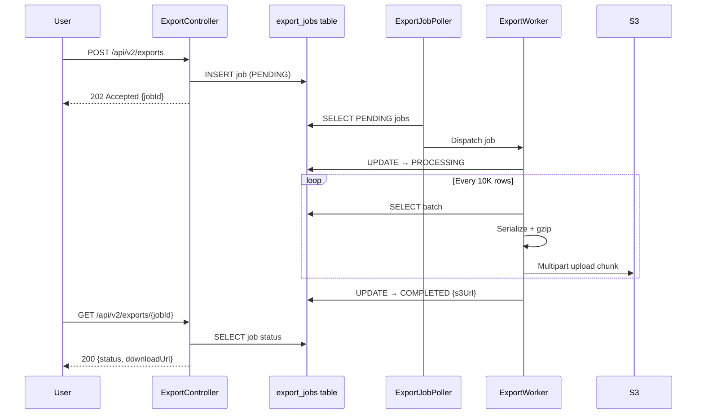
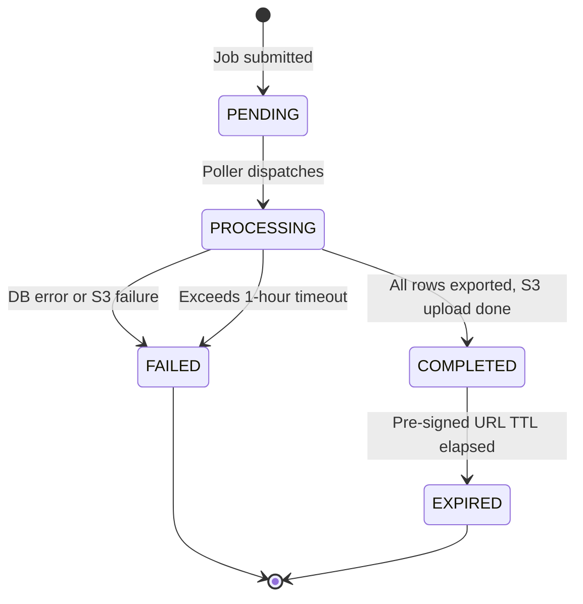
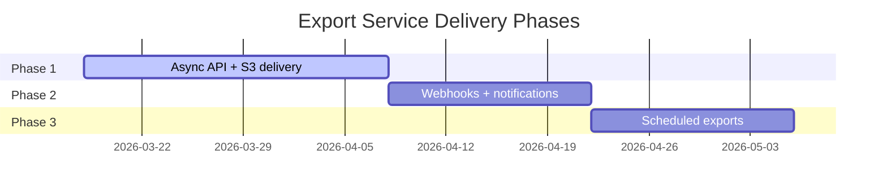

**Technical Owner:** [Human Name]
**AI Co-Author:** @prd-author (AI-Generated)
**Date:** 2026-03-18
**Feature Folder:** docs/features/inventory-service
**Upstream Inputs:** FEATURE_DRAFT.md, DISCOVERY_NOTES.md

# Inventory Management Service — Product Requirements Document

## 1. Executive Summary

**Product Overview:**
The Inventory Management Service enables users to asynchronously export large product datasets (up to 500K rows) in CSV
or JSON Lines format. Exports are delivered as gzip-compressed files via pre-signed S3 URLs. This replaces the current
synchronous CSV endpoint that times out beyond ~5K rows, eliminating the need for manual support tickets for large data
extracts.

**Core Value Proposition:**
Product managers and data partners can self-serve large exports without engineering intervention, reducing support
ticket volume and unblocking offline analysis workflows.

**MVP Goal Statement:**
A user can submit an export request with filters, poll for completion, and download a gzip-compressed file from S3 — all
within the existing auth and RBAC framework.

## 2. Mission & Principles

**Mission Statement:** Provide reliable, self-service bulk data export without degrading the primary product read path.

**Guiding Principles:**

1. **Tenant isolation by default** — exports enforce the same RBAC rules as the UI.
2. **Async-first** — no synchronous endpoints for large datasets.
3. **Infrastructure simplicity** — no new message queues or infrastructure for MVP.

## 3. Target Audience

**Primary Personas:**

- Product Managers exporting data for offline analysis in Excel/Tableau.
- Data Partners receiving product feeds via scheduled manual exports.
- Compliance teams pulling audit snapshots.

**User Pain Points:**

- Sync export times out beyond 5K rows.
- Manual support tickets take 1–3 business days.
- No programmatic export API for integration partners.

**Technical Literacy:** Moderate — users understand REST APIs and can poll for status.

## 4. MVP Scope Matrix

| Category       | In-Scope                                             | Out-of-Scope                           |
|----------------|------------------------------------------------------|----------------------------------------|
| Core Logic     | Async job creation, batched query, gzip, S3 delivery | Webhook callbacks, recurring schedules |
| Formats        | CSV, JSON Lines                                      | Excel, Parquet                         |
| Infrastructure | DB-backed job queue, existing S3                     | SQS, Kafka, per-tenant S3 buckets      |
| Integrations   | Polling status API                                   | Email notifications, Slack alerts      |

## 5. User Stories & Edge Cases

**Standard Stories:**

- As a product manager, I want to export up to 500K products as a CSV so that I can analyze data offline.
- As a data partner, I want to export products as JSON Lines so that I can ingest them into my pipeline.
- As a user, I want to check the status of my export so that I know when the file is ready.

**Technical Stories:**

- As the system, I need to enforce a 3-job concurrency limit per tenant so that no single tenant monopolizes worker
  threads.
- As the system, I need to auto-fail jobs exceeding 1 hour so that stuck jobs don't block the queue.

**Edge Cases:**

1. Empty result set produces a headers-only file (CSV) or empty file (JSON Lines).
2. Duplicate submission returns the existing job ID instead of creating a new job.
3. Mid-export DB failure marks the job FAILED and deletes the partial S3 file.
4. JWT expiry during a long export does not cancel the running job.
5. Concurrent limit exceeded returns HTTP 429 with a Retry-After header.

## 6. Architecture & System Logic

**High-Level Design:** Async job queue backed by a database table, with a Spring @Scheduled poller dispatching to a
bounded thread pool.



## 7. Feature Specifications

**Job Lifecycle States:** PENDING → PROCESSING → COMPLETED | FAILED | EXPIRED



**API Endpoints:**

- `POST /api/v2/exports` — Create export job
- `GET /api/v2/exports/{jobId}` — Poll job status
- `GET /api/v2/exports` — List recent export jobs for the authenticated tenant

## 8. Technology Stack

- **Backend:** Java 17, Spring Boot 3.2
- **Database:** PostgreSQL (existing, via Flyway migrations)
- **Storage:** AWS S3 (existing bucket, AWS SDK v2)
- **Metrics:** Micrometer + Prometheus
- **Tracing:** OpenTelemetry

## 9. Security, Privacy & Data

- **Auth:** JWT-based, validated by existing TenantContextFilter.
- **Tenant Isolation:** All queries include `tenant_id` predicate. Enforced at the service layer.
- **Field Visibility:** RBAC field filters applied before serialization — sensitive fields (e.g., cost_price) excluded
  for restricted roles.
- **S3 Access:** Pre-signed URLs with 24-hour TTL. No public bucket access.

## 10. API & Data Schema

**POST /api/v2/exports**

```json
// Request
{
  "format": "CSV",
  "filters": {
    "categoryId": "electronics",
    "updatedAfter": "2026-01-01T00:00:00Z"
  }
}

// Response (202)
{
  "jobId": "exp-a1b2c3d4",
  "status": "PENDING",
  "createdAt": "2026-03-18T14:30:00Z"
}
```

**GET /api/v2/exports/{jobId}**

```json
// Response (200) — Completed
{
  "jobId": "exp-a1b2c3d4",
  "status": "COMPLETED",
  "format": "CSV",
  "rowCount": 142857,
  "fileSizeBytes": 23456789,
  "downloadUrl": "https://s3.amazonaws.com/...",
  "expiresAt": "2026-03-19T14:30:00Z"
}
```

## 11. Success Metrics (KPIs)

- [ ] Exports up to 500K rows complete within 10 minutes.
- [ ] Zero support tickets for "export timeout" after launch.
- [ ] 99.5% export job success rate (excluding user-cancelled).
- [ ] P95 export latency < 5 minutes for datasets under 100K rows.

## 12. Roadmap & Implementation

| Phase         | Scope                                             | Validation                                            |
|---------------|---------------------------------------------------|-------------------------------------------------------|
| Phase 1 (MVP) | Async API, CSV + JSON Lines, polling, S3 delivery | End-to-end export of 500K rows completes successfully |
| Phase 2       | Webhook callbacks, email notifications            | Callback received within 30s of completion            |
| Phase 3       | Recurring scheduled exports, Excel format         | Schedule triggers export at configured time           |



## 13. Risks & Mitigations

| Risk                                   | Severity | Mitigation                                         |
|----------------------------------------|----------|----------------------------------------------------|
| Read replica lag causes stale data     | Medium   | Document as "eventual consistency" in API response |
| Large exports pressure connection pool | Medium   | Monitor HikariCP metrics, alert at 80% utilization |
| S3 pre-signed URL shared/leaked        | Low      | 24-hour TTL limits exposure window                 |

## 14. Appendix & References

---

### Diagram Decision Rules

Apply these rules after drafting each section. Add a diagram only when it makes the content faster to understand than
prose alone.

| Situation                                            | Diagram type                      | Typical section        |
|------------------------------------------------------|-----------------------------------|------------------------|
| Feature touches 3+ systems or has external consumers | Context diagram (`graph LR`)      | Section 2 or 4         |
| Entity has multiple states and valid transitions     | State machine (`stateDiagram-v2`) | Section 4 or 6         |
| Multi-step flow with branching or multiple actors    | Sequence or flow diagram          | Section 6              |
| Feature has 3+ phases, some parallel                 | Gantt (`gantt`)                   | Section 12 — mandatory |
| Prose description of a flow exceeds 5 steps          | Flow diagram (`graph TD`)         | Nearest section        |

**Do not add a diagram when:**

- The prose is already clear in 3 sentences or fewer
- The diagram would show internal service architecture or class structure — that belongs in TDD
- The diagram duplicates information already in a table in the same section

---

**Glossary:**

- **JSON Lines:** Newline-delimited JSON format, one record per line.
- **Pre-signed URL:** A time-limited S3 URL that grants download access without AWS credentials.

**References:**

- Jira: [link to epic/stories]
- Confluence: [link to relevant pages]
- Repo context: See Section 12 (Repos)
