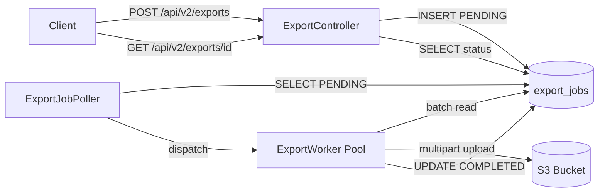
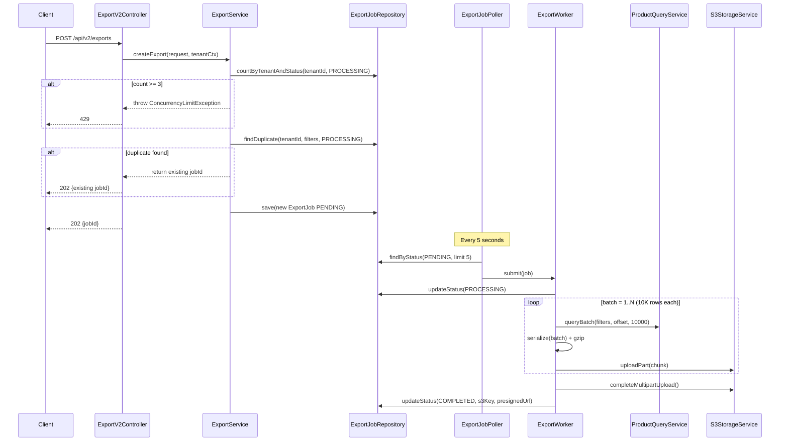

**Technical Owner:** [Human Name]
**AI Co-Author:** @tdd-author (AI-Generated)
**Date:** 2026-03-22
**Version:** 1.0
**Parent PRD:** docs/features/inventory-service/PRD.md
**Upstream Inputs:** SYSTEM_DESIGN_NOTES.md, DISCOVERY_NOTES.md

# Inventory Management Service — Technical Design Document

## 1. Architecture Overview

**Design Philosophy:** Async-first, infrastructure-simple, tenant-isolated. Per ADR-1, we use a DB-backed job queue over
SQS to avoid new infrastructure for a low-volume feature.



**Technology Stack:**

- Java 17, Spring Boot 3.2, Spring @Scheduled
- PostgreSQL 15 (Flyway migrations)
- AWS SDK v2 (S3 multipart upload)
- Micrometer (metrics), OpenTelemetry (tracing)

## 2. Domain & Module Structure

**Feature Boundaries:** New `export` domain module within `distribution-services`. No modifications to existing domain
modules — the export module reads from existing product tables via `ProductQueryService`.

```
distribution-services/src/main/java/com/syndigo/export/
  api/
    ExportV2Controller.java
    dto/
      CreateExportRequest.java
      ExportJobResponse.java
      ExportErrorResponse.java
  domain/
    ExportJob.java
    ExportFormat.java          # enum: CSV, JSON_LINES
    ExportStatus.java          # enum: PENDING, PROCESSING, COMPLETED, FAILED, EXPIRED
  service/
    ExportService.java         # job creation, concurrency check, status queries
    ExportWorker.java          # batch read, serialize, compress, upload
    ExportJobPoller.java       # @Scheduled poller
  repository/
    ExportJobRepository.java   # Spring Data JPA
  serializer/
    CsvExportSerializer.java   # RFC 4180 compliant
    JsonLinesExportSerializer.java
  config/
    ExportConfig.java          # thread pool, batch size, TTL

distribution-services/src/main/resources/db/migration/
  V2026.03.22__create_export_jobs.sql
```

## 3. Data Models & Contracts

**Database Schema:**

```sql
CREATE TABLE export_jobs
(
    id              VARCHAR(36) PRIMARY KEY, -- UUID prefixed "exp-"
    tenant_id       VARCHAR(64)              NOT NULL,
    user_id         VARCHAR(64)              NOT NULL,
    status          VARCHAR(20)              NOT NULL DEFAULT 'PENDING',
    format          VARCHAR(20)              NOT NULL,
    filters         JSONB                    NOT NULL,
    row_count       INTEGER,
    file_size_bytes BIGINT,
    s3_key          VARCHAR(512),
    download_url    VARCHAR(2048),
    expires_at      TIMESTAMP WITH TIME ZONE,
    error_message   VARCHAR(1024),
    created_at      TIMESTAMP WITH TIME ZONE NOT NULL DEFAULT NOW(),
    started_at      TIMESTAMP WITH TIME ZONE,
    completed_at    TIMESTAMP WITH TIME ZONE,

    CONSTRAINT chk_status CHECK (status IN ('PENDING', 'PROCESSING', 'COMPLETED', 'FAILED', 'EXPIRED'))
);

CREATE INDEX idx_export_jobs_tenant_status ON export_jobs (tenant_id, status);
CREATE INDEX idx_export_jobs_created_at ON export_jobs (created_at);
```

**API Contracts:**

`POST /api/v2/exports`

```json
// Request
{
  "format": "CSV | JSON_LINES",
  "filters": {}
}

// 202 Accepted
{
  "jobId": "exp-a1b2c3d4",
  "status": "PENDING",
  "createdAt": "2026-03-22T14:30:00Z"
}

// 429 Too Many Requests
{
  "error": "CONCURRENT_LIMIT_EXCEEDED",
  "message": "Maximum 3 concurrent exports per tenant.",
  "retryAfter": 30
}
```

`GET /api/v2/exports/{jobId}`

```json
// 200 OK (COMPLETED)
{
  "jobId": "exp-a1b2c3d4",
  "status": "COMPLETED",
  "format": "CSV",
  "rowCount": 142857,
  "fileSizeBytes": 23456789,
  "downloadUrl": "https://...",
  "expiresAt": "2026-03-23T14:30:00Z"
}
```

**Core Interfaces:**

```java
public interface ExportSerializer {
    String fileExtension();                    // ".csv.gz" or ".jsonl.gz"

    String contentType();                      // "text/csv" or "application/x-ndjson"

    void writeHeader(OutputStream out);

    void writeBatch(List<ProductRow> batch, OutputStream out);
}
```

## 4. Component Design & Command Lifecycle

**Component Breakdown:**
| Component | Responsibility |
|-----------|---------------|
| `ExportV2Controller` | Auth validation, request parsing, delegates to `ExportService` |
| `ExportService` | Concurrency check, job creation, status queries, duplicate detection |
| `ExportJobPoller` | @Scheduled (5s), picks PENDING jobs, dispatches to worker pool |
| `ExportWorker` | Batch read → serialize → gzip → S3 multipart upload → update status |
| `ExportJobRepository` | CRUD + custom queries (count active per tenant, find PENDING, find stale) |
| `CsvExportSerializer` | RFC 4180 compliant CSV writing with UTF-8 BOM |
| `JsonLinesExportSerializer` | Newline-delimited JSON writing |



## 5. Error Handling & Resilience

| Failure Point                             | Recovery Strategy                                                                                           | Idempotent?                     |
|-------------------------------------------|-------------------------------------------------------------------------------------------------------------|---------------------------------|
| DB connection loss during batch read      | Retry batch 3x with exponential backoff (1s, 2s, 4s). On exhaustion: mark FAILED, delete partial S3 upload. | Yes — batch reads are stateless |
| S3 multipart upload failure               | Abort multipart upload, mark FAILED.                                                                        | Yes — abort is idempotent       |
| Worker thread crash (unhandled exception) | Caught by thread pool's `UncaughtExceptionHandler`. Job marked FAILED.                                      | N/A                             |
| Job stuck > 1 hour                        | `ExportJobPoller` secondary sweep marks PROCESSING jobs older than 1h as FAILED.                            | Yes                             |
| Duplicate export submission               | Return existing job ID.                                                                                     | Yes — by design                 |

**Concurrency:** Bounded thread pool (size 5) prevents runaway resource consumption. Each worker holds a DB connection
only during each 10K batch read (per ADR-2), not for the entire job.

## 6. Observability & Configuration

**Metrics (Micrometer):**

- `export.jobs.submitted` — counter (tenant_id, format)
- `export.jobs.completed` — counter (tenant_id, format, duration_bucket)
- `export.jobs.failed` — counter (tenant_id, failure_reason)
- `export.batch.read.duration` — timer (per 10K batch)
- `export.s3.upload.duration` — timer (per multipart chunk)

**Tracing (OpenTelemetry):**

- `export.job.process` — root span per job
- `export.batch.query` — child span per batch read
- `export.s3.upload` — child span for S3 upload

**Configuration (`application.yml`):**

```yaml
export:
  worker:
    pool-size: 5
    batch-size: 10000
    job-timeout-minutes: 60
  s3:
    bucket: syndigo-exports-${ENVIRONMENT}
    url-ttl-hours: 24
  cleanup:
    retention-days: 30
    cron: "0 0 2 * * *"   # Daily at 2 AM
  concurrency:
    max-per-tenant: 3
  poller:
    interval-ms: 5000
```

## 7. Testing Strategy

**Unit Tests:**

- `CsvExportSerializer`: RFC 4180 compliance (commas, quotes, newlines, Unicode, empty fields)
- `ExportService`: Concurrency limit enforcement, duplicate detection, status transitions
- `ExportWorker`: Batch loop logic, failure handling, retry behavior

**Integration Tests (Testcontainers + LocalStack):**

- Full job lifecycle: create → poll → complete → download from S3
- Concurrency limit: submit 4 jobs, verify 4th returns 429
- Mid-export failure: kill DB mid-batch, verify job marked FAILED and S3 cleaned up
- Empty export: zero-row result set produces valid headers-only file

**Performance Benchmarks:**

- 500K row CSV export completes in < 10 minutes on standard hardware
- Memory usage stays below 256MB during export (no full-dataset buffering)

## 8. Vertical Delivery Slices

| Slice                            | Scope                                                                                                                 | Testable Outcome                                                                                          |
|----------------------------------|-----------------------------------------------------------------------------------------------------------------------|-----------------------------------------------------------------------------------------------------------|
| **Slice 1: Core Job Lifecycle**  | DB migration, ExportJob entity, ExportService (create + status), ExportV2Controller (POST + GET), ExportJobRepository | Can create a PENDING job via API and poll its status. No actual export processing yet.                    |
| **Slice 2: Export Processing**   | ExportWorker, ExportJobPoller, CsvExportSerializer, S3 multipart upload, gzip compression                             | End-to-end: submit job → poller picks up → worker exports CSV to S3 → status COMPLETED with download URL. |
| **Slice 3: JSON Lines + Guards** | JsonLinesExportSerializer, concurrency limit, duplicate detection, stale job cleanup, job history pruning             | Full feature parity: both formats, all safety rails, production-ready.                                    |

## 9. Architecture Decision Records (ADRs) & Open Questions

**ADR-1:** DB-backed job queue over SQS. Low volume, queryable state, no new infra. (from SYSTEM_DESIGN_NOTES.md)

**ADR-2:** Batched JDBC reads over streaming cursor. Connection pool safety — don't hold connections for 5–10 minutes. (
from SYSTEM_DESIGN_NOTES.md)

**ADR-3:** Application-level gzip over S3 Object Lambda. Lower cost, simpler, stored compressed. (from
SYSTEM_DESIGN_NOTES.md)

**Open Questions:** None.

## 10. Resource Requirements

**Memory:**

- **API Service:** 512MB baseline + 256MB per concurrent export worker
- **Worker Process:** 256MB per export job (batched reading, no full-dataset buffering)
- **Total Estimate (5 concurrent exports):** 1.5GB - 2GB

**CPU:**

- **API Service:** 2 vCPU (handling create/poll requests, scheduling workers)
- **Worker Process:** 1 vCPU per export worker (CSV serialization + S3 upload)
- **Total Estimate:** 2-4 vCPU minimum

**Storage:**

- **Database:** 100GB initial allocation (grow by 10GB/month for job history)
    - ExportJob table: ~1KB per job × 10K jobs/month = 10MB/month
    - Indexes + overhead: ~5x = 50MB/month
- **S3:** Unlimited (temporary files deleted after 30 days)
    - Typical export size: 10MB - 500MB per file
    - Retention: 30 days × 500 exports/day × 50MB avg = ~750GB max

**Network:**

- **Database Connection:** 10 concurrent connections (5 workers + 5 API threads)
- **S3 Bandwidth:** 100 Mbps sustained for large exports (500MB file in ~40 seconds)
- **API Ingress:** Low (POST create, GET poll requests < 1KB each)
- **API Egress:** Download URL only (pre-signed S3 URL, no proxy)

**Scaling Considerations:**

- **Horizontal Scaling:** API service can scale to N replicas (stateless)
- **Worker Scaling:** Worker count = available memory / 256MB
- **Database:** Vertical scaling sufficient (single-instance PostgreSQL)
- **S3:** Auto-scales (no limit)

## 11. Deployment Architecture

**Target Platform:** AWS ECS (Fargate) + RDS PostgreSQL + S3

**Deployment Model:**

- **Blue-Green Deployment** with ECS task definition versioning
- **Health Checks:** `/health` endpoint (200 = healthy)
- **Rollback Strategy:** Revert to previous task definition (< 2 minutes)

**Infrastructure as Code (Terraform):**

```hcl
# ecs.tf
resource "aws_ecs_service" "export_api" {
  name            = "export-api-${var.environment}"
  cluster         = aws_ecs_cluster.main.id
  task_definition = aws_ecs_task_definition.export_api.arn
  desired_count   = var.api_replica_count
  launch_type     = "FARGATE"

  load_balancer {
    target_group_arn = aws_lb_target_group.export_api.arn
    container_name   = "export-api"
    container_port   = 8080
  }

  health_check_grace_period_seconds = 60

  deployment_configuration {
    maximum_percent         = 200
    minimum_healthy_percent = 100
    deployment_circuit_breaker {
      enable   = true
      rollback = true
    }
  }
}

# rds.tf
resource "aws_db_instance" "main" {
  identifier           = "export-db-${var.environment}"
  engine               = "postgres"
  engine_version       = "15.3"
  instance_class       = var.db_instance_class  # db.t3.medium
  allocated_storage    = 100
  storage_encrypted    = true
  multi_az             = var.environment == "production"
  backup_retention_period = 7

  db_name  = "exports"
  username = "export_admin"
  password = data.aws_secretsmanager_secret_version.db_password.secret_string
}

# s3.tf
resource "aws_s3_bucket" "exports" {
  bucket = "syndigo-exports-${var.environment}"
  
  lifecycle_rule {
    id      = "cleanup-old-exports"
    enabled = true

    expiration {
      days = 30
    }
  }

  server_side_encryption_configuration {
    rule {
      apply_server_side_encryption_by_default {
        sse_algorithm = "AES256"
      }
    }
  }
}
```

**Kubernetes Alternative (if K8s preferred):**

```yaml
# deployment.yaml
apiVersion: apps/v1
kind: Deployment
metadata:
  name: export-api
spec:
  replicas: 3
  strategy:
    type: RollingUpdate
    rollingUpdate:
      maxSurge: 1
      maxUnavailable: 0
  selector:
    matchLabels:
      app: export-api
  template:
    metadata:
      labels:
        app: export-api
    spec:
      containers:
        - name: export-api
          image: syndigo/export-api:{{.Values.version}}
          ports:
            - containerPort: 8080
          resources:
            requests:
              memory: "512Mi"
              cpu: "500m"
            limits:
              memory: "2Gi"
              cpu: "2000m"
          env:
            - name: DATABASE_URL
              valueFrom:
                secretKeyRef:
                  name: export-db-credentials
                  key: url
            - name: AWS_S3_BUCKET
              value: "syndigo-exports-{{.Values.environment}}"
          livenessProbe:
            httpGet:
              path: /health
              port: 8080
            initialDelaySeconds: 30
            periodSeconds: 10
          readinessProbe:
            httpGet:
              path: /health
              port: 8080
            initialDelaySeconds: 10
            periodSeconds: 5
```

**Deployment Phases:**

1. **Pre-Deployment:** Run database migrations via init container
2. **Health Check:** Wait for `/health` to return 200 (60s timeout)
3. **Traffic Shift:** Blue-green switch (10% → 50% → 100% over 5 minutes)
4. **Smoke Tests:** Run automated smoke tests against new version
5. **Rollback:** Automatic rollback if error rate > 2% or health checks fail

**Monitoring & Alerts:**

- **CloudWatch Alarms:** CPU > 80%, Memory > 90%, Error Rate > 1%
- **Datadog Dashboard:** Export job latency, S3 upload success rate, DB connection pool
- **PagerDuty Integration:** Alert on-call if critical errors detected

**Disaster Recovery:**

- **RTO (Recovery Time Objective):** 15 minutes (restore from automated backup)
- **RPO (Recovery Point Objective):** 5 minutes (RDS automated backups + transaction logs)
- **Multi-Region:** Not required for v1 (single-region deployment sufficient)
